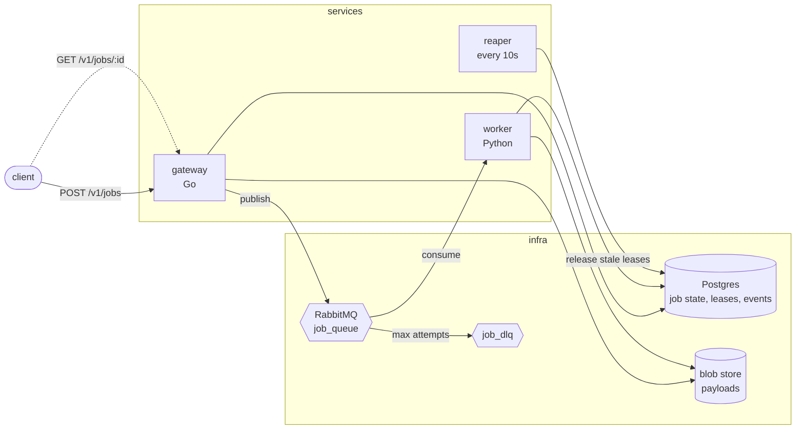
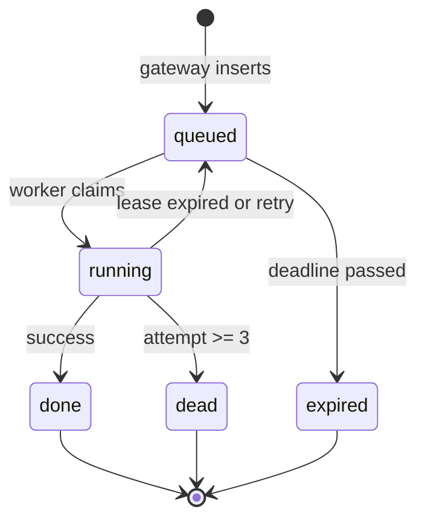
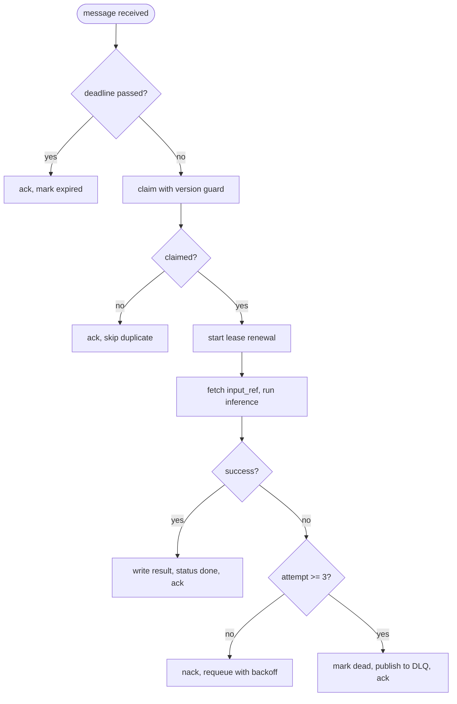
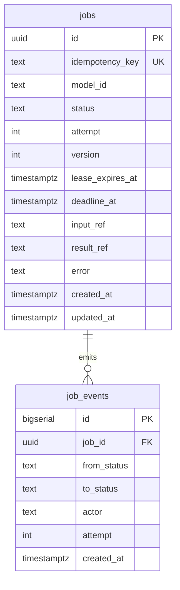

# Sluice

A resilient async inference runner. Go gateway, Python workers, RabbitMQ, Postgres.

Submit a job, get an ID back immediately, collect the result when it's ready. Built so that nothing is silently lost when things crash — which they will.

---

## Why this exists

Inference has three properties that break normal request/response:

1. **Service time is long and wildly variable** — a classifier is 20 ms, a large generation is 40 s. Same system, 2000x spread.
2. **Capacity is fixed and expensive** — you can't scale a GPU in 200 ms.
3. **Arrivals are bursty** — humans, batch jobs, and retries all spike.

A normal web service violates none of these, which is why it doesn't need a queue. Inference violates all three, so the work has to be buffered somewhere durable while capacity catches up.

Sluice is that buffer, plus the machinery to make sure work that gets interrupted comes back.

---

## Design principles

- **Failure-first.** The drills in [Definition of done](#definition-of-done) were written before the code. A feature isn't finished until its failure path is demonstrated, not reasoned about.
- **At-least-once delivery, idempotent execution.** The broker guarantees a message arrives *at least* once. Exactly-once is built in the database with a conditional claim, not expected from infrastructure.
- **Durable before acknowledged.** The worker writes the result, *then* acks. Reversing this trades a recoverable duplicate for a silent loss.
- **Claim check.** Payloads live in blob storage; the queue and the job row carry references. Messages stay small so the broker never hits memory flow control.
- **Bulkheads over priorities.** Workload classes get separate queues and separate worker pools, so one class can't starve another.
- **Nothing waits forever.** Every network call has a timeout. Every job has a deadline. Every claim has a lease.

---

## Architecture



| Service | Owns |
|---|---|
| `gateway` | HTTP API, authn, admission control, publish, read job state |
| `worker` | consume, claim, run inference, write result |
| `reaper` | release leases held by workers that died |
| `broker` | `job_queue`, `job_dlq` |
| `db` | job state, leases, idempotency ledger, event audit |

### About the reaper

A worker claims a job, sets `status = running`, then dies. RabbitMQ correctly redelivers the message — but the row still says `running`, and the claim guard only accepts `queued`. The job is stuck forever with no error and no alert.

The worker sets `lease_expires_at = now() + 30s` on claim and renews it every 10 s while working. The reaper releases anything whose lease has gone stale. It's a dead man's switch: liveness is proven by continued action, because a dead process can't tell you it died.

The general shape — **two systems that can silently disagree need a third to reconcile them.** The broker knows the message is unacked; the database knows the row is running; neither knows about the other.

---

## Job lifecycle



Every transition has exactly one owner. Where two components could write the same transition, there's a race.

| Transition | Owner | Guard |
|---|---|---|
| `-> queued` | gateway | insert, unique on `idempotency_key` |
| `queued -> running` | worker | `WHERE status='queued' AND version=?` |
| `running -> done` | worker | `WHERE id=? AND version=?` |
| `running -> queued` | reaper | `WHERE lease_expires_at < now()` |
| `running -> dead` | worker | `attempt >= max_attempts` |
| `queued -> expired` | reaper | `WHERE deadline_at < now()` |

---

## Worker loop



`ack, skip duplicate` is **not** an error path. It's the expected outcome of a redelivery whose work already completed. Track it as a metric; don't alert on it.

---

## Data model



**Indexes**

```sql
UNIQUE (idempotency_key);
CREATE INDEX ON jobs (status, lease_expires_at);
CREATE INDEX ON job_events (job_id, created_at);
```

`version` is optimistic concurrency. Every state write carries the version it read; zero rows affected means someone else won the race, so re-read and retry.

`job_events` is append-only. When a job ends up somewhere you can't explain, this is the only thing that will tell you how it got there.

---

## API

```
POST /v1/jobs          202 {job_id}  |  429 + Retry-After  |  409 on idempotency replay
GET  /v1/jobs/:id      200 {status, result_ref?, error?}
GET  /healthz          liveness
GET  /readyz           readiness — checks broker and db
GET  /metrics          prometheus
```

**Message contract** — deliberately thin. The payload never travels on the queue.

```json
{
  "job_id": "0f8a...",
  "attempt": 1,
  "traceparent": "00-4bf9..."
}
```

`traceparent` is W3C trace context. Without it the distributed trace dies at the queue boundary and you lose the ability to follow a request end to end.

---

## Configuration

| Setting | Default | Notes |
|---|---|---|
| `PREFETCH_COUNT` | `1` | higher values let one worker hoard while others idle |
| `MAX_ATTEMPTS` | `3` | then dead-letter |
| `LEASE_TTL` | `30s` | |
| `LEASE_RENEW_INTERVAL` | `10s` | must be well under `LEASE_TTL` |
| `REAPER_INTERVAL` | `10s` | |
| `JOB_DEADLINE_DEFAULT` | `5m` | worker drops expired jobs *before* running inference |
| `CONSUMER_TIMEOUT` | `15m` | broker-side; must exceed p99 job duration |
| `SHED_QUEUE_DEPTH` | `1000` | gateway returns 429 above this |
| `SHUTDOWN_GRACE` | `90s` | must exceed p99 job duration |

---

## Running locally

```bash
docker compose up -d
curl -X POST localhost:8080/v1/jobs \
  -H 'content-type: application/json' \
  -d '{"model_id":"echo","input":"hello","idempotency_key":"demo-1"}'
```

RabbitMQ management UI is on `localhost:15672`. Keep it open — watching queue depth and unacked counts move is most of the value.

The default model is a stub: `sleep(random 0.5-8s)` with a 5% failure rate. This is intentional. The distributed systems problems here are independent of the model, so the stub lets you reproduce any failure scenario on demand and run 50 workers on a laptop.

---

## Definition of done

Five drills. Code that passes fewer than five isn't finished.

| # | Drill | Expected |
|---|---|---|
| 1 | `docker kill -s KILL` a worker mid-job | redelivered, executes exactly once, result correct |
| 2 | 5 workers, one 60 s job | other four keep draining; no head-of-line block |
| 3 | job that always raises | dead-letters after 3 attempts, no infinite loop |
| 4 | 5000 jobs, 1 worker | gateway sheds with 429 + Retry-After, backlog stays bounded |
| 5 | scale down mid-job | in-flight work drains, nothing dropped |

Run each one **without** the fix first, so you see the failure. A pattern you've watched break is one you remember.

---

## Not yet implemented

- Delayed retry — `nack` requeues immediately, so a downstream outage burns all 3 attempts in about a second. Needs the delayed-message-exchange plugin or a TTL + dead-letter loop.
- Long polling via Postgres `LISTEN/NOTIFY` — clients currently poll on `Retry-After`.
- Token streaming — needs a pub/sub relay for fanout, since the SSE connection lives on one specific gateway replica.
- Separate queues per workload class.
- Transactional outbox — the gateway writes the job row then publishes; a crash between the two loses the job. Idempotency covers the duplicate case but not this one.

## Non-goals

- **Not a model server.** No batching, no GPU scheduling, no KV cache management. The worker is a thin adapter; put vLLM or Triton behind it.
- **Not a workflow engine.** No DAGs, no fan-out/fan-in, no compensation. Reach for Temporal if you need those.
- **Not multi-tenant.** No per-tenant quotas or isolation.
- **Not for interactive chat.** Held-open streaming connections want a direct path with admission control, not a durable queue — durability buys nothing if the socket is already gone.
