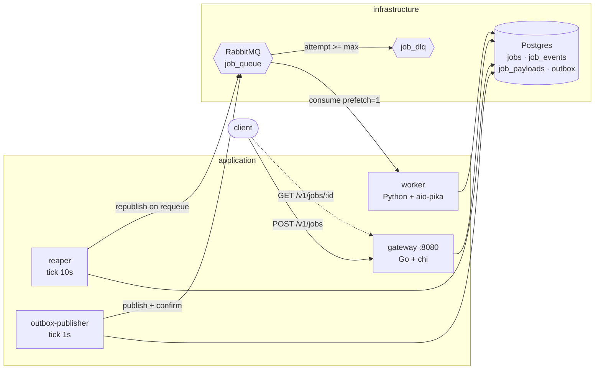
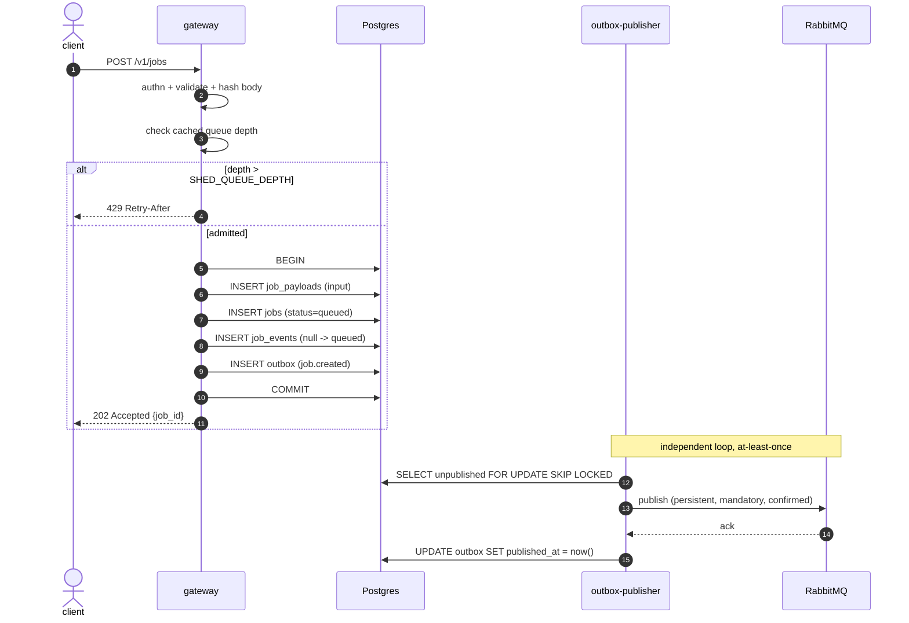
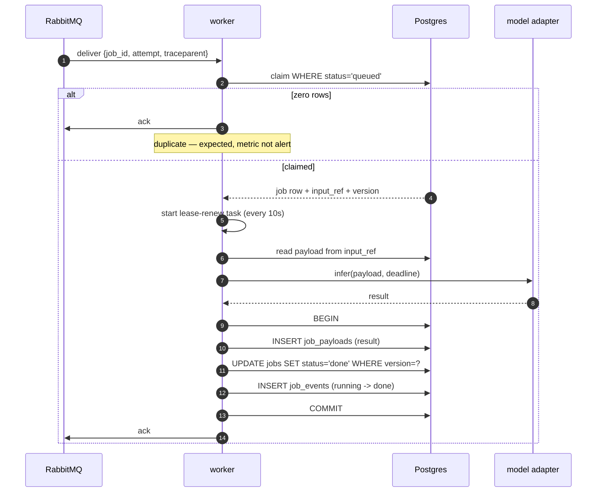
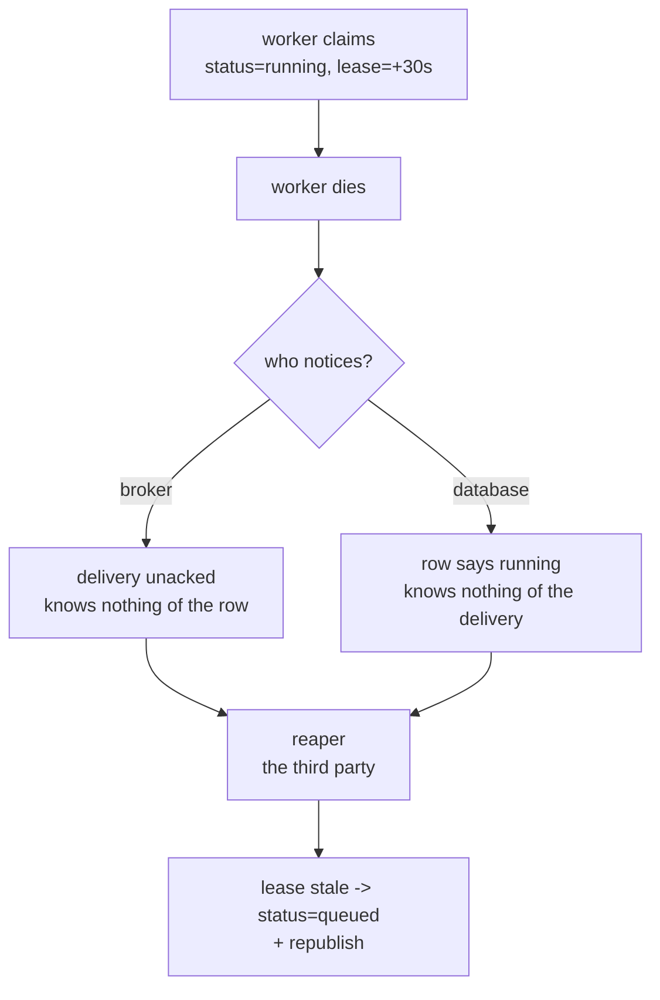

# Architecture

Index: [[00_index]] · Next: [[02_tech_stack]]

---

## Processes

Four binaries. Everything stateless except Postgres and RabbitMQ.

| Process | Language | Replicas | Owns |
|---|---|---|---|
| `gateway` | Go | n (behind LB) | HTTP API, authn, admission control, payload write, publish, job reads |
| `worker` | Python | n | consume, claim, run inference, write result |
| `reaper` | Go | n (safe to run several) | release stale leases, expire past-deadline jobs |
| `outbox-publisher` | Go | n (safe) | drain `outbox` → broker with confirms — see [[05_messaging_topology#Transactional outbox]] |

`reaper` and `outbox-publisher` are separate `cmd/` entrypoints but can be compiled into one `sluice-workers` binary with a subcommand if you'd rather run fewer containers. Both are safe at n>1 because every claim uses `FOR UPDATE SKIP LOCKED` — **no leader election required**.

---

## Container view

Note what is **not** there: the gateway never talks to the worker, and the worker never talks to the gateway. All coordination is through Postgres and the broker. That is what makes both horizontally scalable and independently deployable.

---

## Submit path

Four writes in one transaction, then a `202`. The client is never blocked on the broker. If the broker is down, jobs still accept and drain later — the outbox absorbs it.

---

## Execute path

**Durable before acknowledged.** The `COMMIT` precedes the `ack`. Reverse them and a crash in between silently loses the job; in this order a crash produces a redelivery, which the claim guard turns into a harmless duplicate skip.

---

## Transition ownership

Every transition has exactly one writer. Where two components could write the same transition, there is a race.

| Transition | Owner | Guard |
|---|---|---|
| `∅ → queued` | gateway | `INSERT`, unique on `idempotency_key` |
| `queued → running` | worker | `WHERE status = 'queued'` |
| `running → done` | worker | `WHERE version = ? AND lease_owner = ?` |
| `running → failed_retry → queued` | worker | `attempt < max_attempts` |
| `running → dead` | worker | `attempt >= max_attempts`, or terminal error |
| `running → queued` | reaper | `WHERE lease_expires_at < now()` |
| `queued → expired` | reaper | `WHERE deadline_at < now()` |

Full SQL for each: [[04_data_model#Guarded transitions]].

---

## Why the reaper exists

A worker claims a job, sets `status = 'running'`, then is `SIGKILL`ed.

RabbitMQ behaves correctly — the delivery was never acked, so it redelivers. But the row still says `running`, and the claim guard only accepts `queued`. The redelivery matches zero rows, the worker acks it as a duplicate, and the job is stranded in `running` **forever**, with no error and no alert. This is the worst class of bug: silent, permanent, and invisible to both systems involved.

The fix is a dead man's switch. On claim the worker sets `lease_expires_at = now() + 30s` and renews every 10 s while working. Liveness is proven by continued action, because a dead process cannot report its own death. The reaper releases anything whose lease has gone stale.

The general shape, worth internalising: **two systems that can silently disagree need a third to reconcile them.** The broker knows the message is unacked. The database knows the row is running. Neither knows about the other, and neither can be taught to without coupling them.

---

## What the reaper is *not*

It is not a retry mechanism, and it must not become one. It only ever restores a row to a state the normal flow can pick up from. If you find yourself adding business logic to the reaper, the transition you are modelling has the wrong owner.

---

Next: [[02_tech_stack]]
