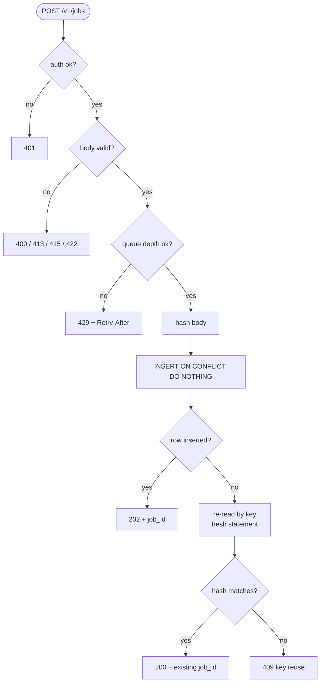

# API Contract

Index: [[00_index]] · Prev: [[02_tech_stack]] · Next: [[04_data_model]]

---

## Surface

```
POST   /v1/jobs              202 {job_id}  ·  200 on replay  ·  409  ·  429
GET    /v1/jobs/{id}         200 {status, ...}
GET    /v1/jobs/{id}/result  200 payload bytes  ·  409 if not finished
GET    /healthz              200 always — liveness
GET    /readyz               200 | 503 — checks Postgres and broker
GET    /metrics              Prometheus exposition
```

```go
r := chi.NewRouter()
r.Use(middleware.RequestID, middleware.Recoverer, middleware.RealIP)
r.Use(otelhttp.NewMiddleware("gateway"))
r.Use(api.AccessLog(logger), api.MaxBody(cfg.MaxPayloadBytes))

r.Get("/healthz", h.Healthz)   // no auth, no shed — must never fail on dependencies
r.Get("/readyz", h.Readyz)
r.Handle("/metrics", promhttp.Handler())

r.Route("/v1/jobs", func(r chi.Router) {
    r.Use(api.Auth(cfg.APITokens))
    r.With(api.ShedOnQueueDepth(depth, cfg.ShedQueueDepth)).Post("/", h.CreateJob)
    r.Get("/{id}", h.GetJob)
    r.Get("/{id}/result", h.GetJobResult)
})
```

Note the shed middleware is scoped to `POST` only. Shedding reads would be actively harmful: a client that cannot poll cannot ever collect the result of work already accepted and paid for.

---

## POST /v1/jobs

```http
POST /v1/jobs HTTP/1.1
Authorization: Bearer <token>
Content-Type: application/json
Idempotency-Key: demo-1

{
  "model_id": "echo",
  "input": "hello",
  "deadline_ms": 300000
}
```

```http
HTTP/1.1 202 Accepted
Content-Type: application/json
Location: /v1/jobs/0f8a1c2e-...

{
  "job_id":     "0f8a1c2e-...",
  "status":     "queued",
  "model_id":   "echo",
  "attempt":    0,
  "created_at": "2026-08-23T10:41:54Z",
  "deadline_at":"2026-08-23T10:46:54Z",
  "poll_after_ms": 1000
}
```

### Validation

| Field | Rule | On violation |
|---|---|---|
| `Idempotency-Key` | required, 8–255 chars | `400` |
| `model_id` | required, present in the adapter registry, ≤ 64 chars | `422` |
| `input` | required, ≤ `MAX_PAYLOAD_BYTES` (default 1 MB) | `413` |
| `deadline_ms` | optional, 1 000 – 3 600 000; default `JOB_DEADLINE_DEFAULT` | `400` |
| body | valid JSON, `Content-Type: application/json` | `400` / `415` |

The size cap is enforced with `http.MaxBytesReader` **before** decoding, so an oversized body is rejected without ever being buffered in full.

---

## Idempotency

`Idempotency-Key` travels as a **header**, which is where the industry puts it (Stripe, Square, and the IETF `idempotency-key-header` draft all agree) and where it belongs: it describes the delivery attempt, not the job. The `idempotency_key` body field from the README curl is still accepted as an alias, with the header winning if both appear.

The gateway stores `request_hash = sha256(canonical_body)` alongside the key. That single extra column is what lets replay and misuse be told apart:

| Case | Response |
|---|---|
| New key | `202` + new `job_id` |
| Same key, **same** hash | `200` + the **existing** `job_id` |
| Same key, **different** hash | `409` |

### Why replay is 200, not 409

This is a deliberate departure from `README.MD`, and it is the more useful semantic.

A client whose `POST` times out at the network layer cannot tell whether the request landed. Its only safe move is to retry with the same key. If that retry returns `409`, the client has to treat an *error* response as the success path and dig the `job_id` out of an error body — so the ordinary retry path becomes the exception path. Returning `200` with the same `job_id` makes retrying trivially safe, which is the entire purpose of an idempotency key.

`409` is then reserved for a genuine client bug: the same key reused for different work. That is worth surfacing loudly, because silently returning the first job's result for a second, different request would be a data-correctness failure.

### The concurrent-duplicate race

Two identical requests land at two gateway replicas simultaneously.

```go
job, err := q.InsertJob(ctx, params)   // ON CONFLICT (idempotency_key) DO NOTHING
if errors.Is(err, pgx.ErrNoRows) {
    // Someone else won. Re-read in a SEPARATE statement.
    job, err = q.GetJobByIdempotencyKey(ctx, key)
    if err != nil {
        return err
    }
    if !bytes.Equal(job.RequestHash, params.RequestHash) {
        return problem.Conflict("idempotency_key_reuse", ...)
    }
    return respond(w, 200, job)   // replay
}
return respond(w, 202, job)
```

> **Snapshot gotcha, worth knowing.** The tempting version of this is one clever `INSERT ... ON CONFLICT DO NOTHING` CTE with a `UNION ALL SELECT` fallback. It is subtly broken: both arms of the statement read the *same* MVCC snapshot, so if a concurrent transaction committed the conflicting row after that snapshot was taken, the `SELECT` arm cannot see it either — and the statement returns **zero rows**. The fetch has to be a separate statement to get a fresh snapshot.

---

## GET /v1/jobs/{id}

```http
HTTP/1.1 200 OK
Retry-After: 2

{
  "job_id":   "0f8a1c2e-...",
  "status":   "running",
  "model_id": "echo",
  "attempt":  1,
  "created_at":  "2026-08-23T10:41:54Z",
  "updated_at":  "2026-08-23T10:41:56Z",
  "deadline_at": "2026-08-23T10:46:54Z",
  "result_url":  null,
  "error":       null
}
```

| `status` | `result_url` | `error` | `Retry-After` |
|---|---|---|---|
| `queued` | `null` | `null` | yes |
| `running` | `null` | `null` | yes |
| `done` | `/v1/jobs/{id}/result` | `null` | — |
| `dead` | `null` | set | — |
| `expired` | `null` | set | — |

`404` if the id is unknown or malformed — deliberately not distinguishing "never existed" from "not yours", since a probe should not be able to enumerate job ids.

### Why result_url and not result_ref

`README.MD` returns `result_ref`. Internally that ref is `db://job_payloads/<id>` today and `s3://...` later ([[04_data_model#job_payloads]]). Handing a client an internal storage URI leaks the backend and pins the API to it.

`GET /v1/jobs/{id}/result` streams the bytes instead, so **swapping Postgres for S3 is invisible to every client.** When the store does move to S3, this endpoint can start issuing a `302` to a presigned URL without a contract change.

Polling remains the collection mechanism for now; `LISTEN/NOTIFY` long-poll is Phase 9 in [[10_roadmap]].

---

## Errors — RFC 9457

One shape for every error, `application/problem+json`. RFC 9457 (which obsoletes 7807) is the current standard and saves inventing a bespoke envelope.

```http
HTTP/1.1 429 Too Many Requests
Content-Type: application/problem+json
Retry-After: 3

{
  "type":     "https://sluice.dev/problems/queue-full",
  "title":    "Queue is full",
  "status":   429,
  "detail":   "Queue depth 1043 exceeds SHED_QUEUE_DEPTH of 1000.",
  "instance": "/v1/jobs",
  "request_id": "01J8ZQ4T7K2M9XVB",
  "retry_after_ms": 3000
}
```

`request_id` comes from `middleware.RequestID` and appears on every log line for that request, so a user-reported error id resolves to a trace in one query. See [[08_observability#Correlation]].

| Status | `type` slug | Cause |
|---|---|---|
| `400` | `malformed-request` | bad JSON, missing/invalid key, bad `deadline_ms` |
| `401` | `unauthorized` | missing or bad bearer token |
| `404` | `job-not-found` | unknown id |
| `409` | `idempotency-key-reuse` | same key, different body hash |
| `409` | `result-not-ready` | `/result` on a job that is not `done` |
| `413` | `payload-too-large` | body over `MAX_PAYLOAD_BYTES` |
| `415` | `unsupported-media-type` | wrong `Content-Type` |
| `422` | `unknown-model` | `model_id` not in the registry |
| `429` | `queue-full` | queue depth over `SHED_QUEUE_DEPTH` |
| `503` | `not-ready` | `/readyz` with a failed dependency |

---

## Submit flow



---

## healthz vs readyz

The distinction matters more than it looks.

| | `/healthz` | `/readyz` |
|---|---|---|
| Question | is the process alive? | can it serve traffic? |
| Checks | nothing — returns `200` if it can respond | `pool.Ping` + broker channel open |
| Orchestrator action on failure | **restart the container** | **remove from the load balancer** |

`/healthz` must never check Postgres. If it did, a database blip would fail liveness, the orchestrator would restart every gateway replica, and the restarts would hammer the recovering database — turning a brief outage into an outage plus a thundering herd. Liveness answers "is this process wedged"; nothing else.

```go
func (h *H) Readyz(w http.ResponseWriter, r *http.Request) {
    ctx, cancel := context.WithTimeout(r.Context(), 2*time.Second)
    defer cancel()

    failed := map[string]string{}
    if err := h.pool.Ping(ctx); err != nil {
        failed["postgres"] = err.Error()
    }
    if err := h.broker.Check(ctx); err != nil {
        failed["rabbitmq"] = err.Error()
    }
    if len(failed) > 0 {
        respondProblem(w, 503, "not-ready", failed)   // says WHICH dependency
        return
    }
    w.WriteHeader(200)
}
```

---

## Auth

Bearer token, compared with `crypto/subtle.ConstantTimeCompare` against a set loaded from `API_TOKENS`. Sluice is explicitly **not multi-tenant** ([[README|README.MD]] non-goals), so a small set of shared static tokens is the honest scope.

What that means in practice, stated so it is not mistaken for production-ready: there are no per-client quotas, no key rotation, no revocation list, and no per-tenant isolation of job ids. Anything beyond a laptop needs tokens from a secret store, a real identity provider, and per-client rate limits before it faces untrusted callers.

---

## Graceful shutdown

```go
srv := &http.Server{Addr: ":8080", Handler: r}

go func() { _ = srv.ListenAndServe() }()

<-ctx.Done()   // SIGTERM
shutdownCtx, cancel := context.WithTimeout(context.Background(), cfg.ShutdownGrace)
defer cancel()
_ = srv.Shutdown(shutdownCtx)   // stop accepting, drain in-flight
pool.Close()
```

`Shutdown` stops accepting new connections and lets in-flight requests finish. Because the gateway only ever writes to Postgres and returns, its in-flight work is milliseconds — `SHUTDOWN_GRACE` of 90 s matters far more for the **worker**, where a request in flight is a 40-second inference. See [[06_worker_and_serving#Graceful shutdown]].

---

Next: [[04_data_model]]
