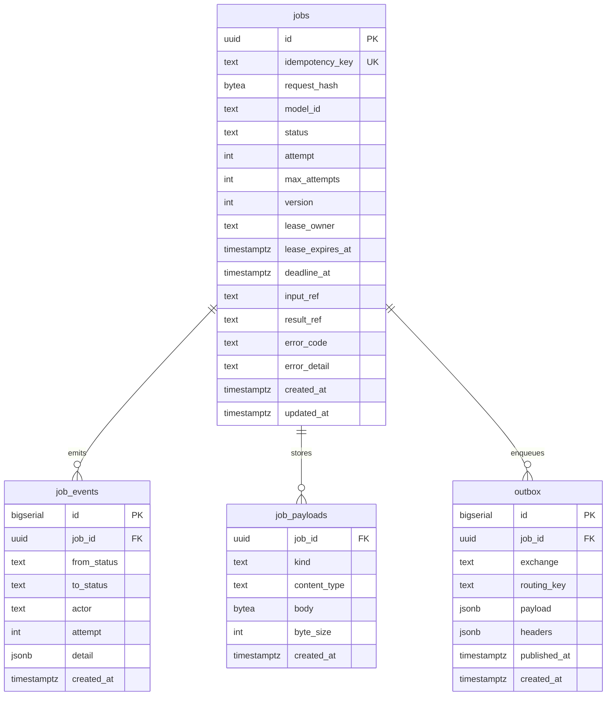
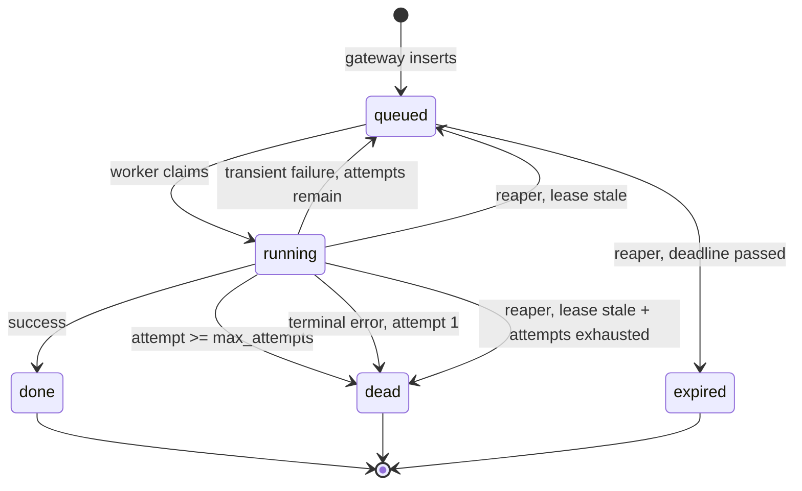

# Data Model

Index: [[00_index]] · Prev: [[03_api_contract]] · Next: [[05_messaging_topology]]

Four tables. The interesting content is not the DDL, it is the `WHERE` clauses in [[#Guarded transitions]] — that is where exactly-once execution is actually constructed.

---

## ERD



---

## DDL

```sql
-- migrations/00001_init.sql
-- +goose Up

CREATE TABLE jobs (
    id                uuid        PRIMARY KEY DEFAULT gen_random_uuid(),
    idempotency_key   text        NOT NULL,
    request_hash      bytea       NOT NULL,
    model_id          text        NOT NULL,
    status            text        NOT NULL DEFAULT 'queued',
    attempt           int         NOT NULL DEFAULT 0,
    max_attempts      int         NOT NULL DEFAULT 3,
    version           int         NOT NULL DEFAULT 1,
    lease_owner       text,
    lease_expires_at  timestamptz,
    deadline_at       timestamptz NOT NULL,
    input_ref         text        NOT NULL,
    result_ref        text,
    error_code        text,
    error_detail      text,
    created_at        timestamptz NOT NULL DEFAULT now(),
    updated_at        timestamptz NOT NULL DEFAULT now(),

    CONSTRAINT jobs_idempotency_key_uniq UNIQUE (idempotency_key),

    CONSTRAINT jobs_status_valid CHECK (
        status IN ('queued','running','done','dead','expired')
    ),
    CONSTRAINT jobs_attempt_bounded CHECK (attempt <= max_attempts),

    -- A lease exists exactly when the job is running. Makes
    -- "running with nobody holding it" unrepresentable, so every exit
    -- from running is forced to clear the lease.
    CONSTRAINT jobs_lease_consistency CHECK (
        (status = 'running')
        = (lease_owner IS NOT NULL AND lease_expires_at IS NOT NULL)
    ),

    -- A done job always has a result to collect.
    CONSTRAINT jobs_done_has_result CHECK (
        status <> 'done' OR result_ref IS NOT NULL
    )
);

CREATE TABLE job_events (
    id          bigserial   PRIMARY KEY,
    job_id      uuid        NOT NULL REFERENCES jobs(id) ON DELETE CASCADE,
    from_status text,                      -- NULL on creation
    to_status   text        NOT NULL,
    actor       text        NOT NULL,      -- gateway | worker:<id> | reaper:<id>
    attempt     int         NOT NULL,
    detail      jsonb,                     -- never a payload; see PDPA note
    created_at  timestamptz NOT NULL DEFAULT now()
);

CREATE TABLE job_payloads (
    job_id       uuid        NOT NULL REFERENCES jobs(id) ON DELETE CASCADE,
    kind         text        NOT NULL CHECK (kind IN ('input','result')),
    content_type text        NOT NULL DEFAULT 'application/octet-stream',
    body         bytea       NOT NULL,
    byte_size    int         GENERATED ALWAYS AS (octet_length(body)) STORED,
    created_at   timestamptz NOT NULL DEFAULT now(),
    PRIMARY KEY (job_id, kind)
);

CREATE TABLE outbox (
    id           bigserial   PRIMARY KEY,
    job_id       uuid        NOT NULL REFERENCES jobs(id) ON DELETE CASCADE,
    exchange     text        NOT NULL,
    routing_key  text        NOT NULL,
    payload      jsonb       NOT NULL,
    headers      jsonb       NOT NULL DEFAULT '{}',
    attempt      int         NOT NULL DEFAULT 0,
    published_at timestamptz,
    created_at   timestamptz NOT NULL DEFAULT now()
);

CREATE FUNCTION set_updated_at() RETURNS trigger AS $$
BEGIN
    NEW.updated_at = now();
    RETURN NEW;
END;
$$ LANGUAGE plpgsql;

CREATE TRIGGER jobs_updated_at BEFORE UPDATE ON jobs
    FOR EACH ROW EXECUTE FUNCTION set_updated_at();

-- +goose Down
DROP TABLE outbox, job_payloads, job_events, jobs;
DROP FUNCTION set_updated_at;
```

`status` is `text` + `CHECK`, not a Postgres `ENUM`. Adding a value to an enum type is awkward to do safely inside a migration transaction; altering a `CHECK` constraint is a plain `ALTER TABLE`. The type safety you want is in the Go layer anyway, where sqlc gives you a `job.Status` type.

`updated_at` is a trigger rather than a column set by hand in every `UPDATE`. It is the one field that is pure bookkeeping, and forgetting it in one statement produces a quietly wrong audit trail.

---

## Indexes

```sql
-- Reaper lease sweep. Only running rows can hold a stale lease, so index
-- only those. This is a refinement on the README's (status, lease_expires_at):
-- a composite index covers every row including the millions of terminal ones,
-- while this partial index holds only in-flight work and therefore stays
-- permanently small no matter how large the table grows.
CREATE INDEX jobs_stale_lease_idx ON jobs (lease_expires_at)
    WHERE status = 'running';

-- Reaper deadline sweep, same reasoning.
CREATE INDEX jobs_deadline_idx ON jobs (deadline_at)
    WHERE status = 'queued';

-- Audit read path: "how did this job get here?"
CREATE INDEX job_events_job_idx ON job_events (job_id, created_at);

-- Outbox drain. Normally near-empty, and the index reflects that.
CREATE INDEX outbox_pending_idx ON outbox (created_at)
    WHERE published_at IS NULL;
```

Four indexes, three of them partial. Both hot sweeps run every 10 s forever, so their cost must not scale with total history — only with work currently in flight.

---

## Least privilege

The application role gets no `UPDATE` or `DELETE` on `job_events`. That makes the audit log append-only **structurally**, rather than by convention that a future bug can violate.

```sql
CREATE ROLE sluice_app LOGIN PASSWORD :'app_password';

GRANT SELECT, INSERT, UPDATE          ON jobs         TO sluice_app;
GRANT SELECT, INSERT                  ON job_events   TO sluice_app;  -- append-only
GRANT SELECT, INSERT, DELETE          ON job_payloads TO sluice_app;
GRANT SELECT, INSERT, UPDATE, DELETE  ON outbox       TO sluice_app;
GRANT USAGE, SELECT ON ALL SEQUENCES IN SCHEMA public TO sluice_app;
```

Migrations run as the owner; the services connect as `sluice_app`. No service ever connects as a superuser. The `DELETE` on `job_payloads` exists only for the retention purge below.

---

## job_payloads

The claim-check store. The payload never rides the queue — the message carries a reference and nothing else ([[05_messaging_topology#Message contract]]).

```
input_ref  = db://job_payloads/<job_id>?kind=input
result_ref = db://job_payloads/<job_id>?kind=result
```

Both live behind one interface, so the backend is swappable without touching a caller:

```go
type BlobStore interface {
    Put(ctx context.Context, jobID uuid.UUID, kind Kind, body []byte, contentType string) (ref string, err error)
    Get(ctx context.Context, ref string) (body []byte, contentType string, err error)
    Delete(ctx context.Context, ref string) error
}
```

**Why Postgres is a defensible first backend.** `bytea` values over roughly 2 KB are moved out of the main heap into TOAST storage and compressed, so large payloads do not bloat the pages that the hot job queries scan. Writing input and job row in one transaction also removes an entire failure mode: with an external store you can orphan a blob if the row insert fails, or reference a missing blob if the order is reversed.

**When to move to S3.** Two signals: payloads regularly exceeding a few MB (every write hits the WAL twice, so throughput suffers), or a need to hand clients a presigned URL rather than proxying bytes through the gateway. `GET /v1/jobs/{id}/result` was designed so that move is invisible to clients ([[03_api_contract#Why result_url and not result_ref]]).

If payloads are known to be incompressible (images, audio, already-gzipped blobs), skip the pointless compression attempt:

```sql
ALTER TABLE job_payloads ALTER COLUMN body SET STORAGE EXTERNAL;
```

---

## State machine



`done`, `dead`, and `expired` are terminal — nothing leaves them. That is what makes the partial indexes above stay small.

---

## Guarded transitions

### Why the claim needs no version guard

`README.MD` guards the claim with `WHERE status = 'queued' AND version = ?`. The version predicate is unnecessary there, and dropping it removes a round trip.

A single `UPDATE` statement takes a row-level lock. Two workers claiming the same job serialise: the second blocks, then **re-evaluates its `WHERE` against the newly committed row**, sees `status = 'running'`, and matches zero rows. The status predicate is already the guard, atomically.

Requiring `version = ?` would mean the worker must `SELECT` the row first to learn the version — turning one atomic statement into a read-then-write for exactly the same guarantee.

Version earns its keep where there is a real **gap** between read and write. That is the result write: claim at T+0, run inference for 40 s, write at T+40. Inside that window the reaper may have expired the lease and another worker may have claimed *and finished* the job. The version read at T+0 no longer matches, and the stale write must fail. **Optimistic concurrency is for long gaps; a status predicate is enough for a single statement.**

### Claim: queued to running

Owner: **worker**.

```sql
-- name: ClaimJob :one
UPDATE jobs
   SET status           = 'running',
       attempt          = attempt + 1,
       lease_owner      = $2,
       lease_expires_at = now() + $3::interval,
       version          = version + 1
 WHERE id = $1
   AND status = 'queued'
   AND deadline_at > now()
RETURNING *;
```

`pgx.ErrNoRows` means one of: already claimed (duplicate delivery), already terminal, or past deadline. All three resolve the same way — **ack and move on**. That is the `ack, skip duplicate` path from the README, and it is a normal outcome, not an error. Count it, never alert on it ([[08_observability#Metrics]]).

### Renew lease

Owner: **worker**, every `LEASE_RENEW_INTERVAL`.

```sql
-- name: RenewLease :one
-- Deliberately does NOT bump version. The lease is liveness metadata,
-- not job state; bumping it here would invalidate the version this
-- worker is holding for its own result write, and every long job
-- would fail to complete after its first renewal.
UPDATE jobs
   SET lease_expires_at = now() + $3::interval
 WHERE id = $1
   AND lease_owner = $2
   AND status = 'running'
RETURNING lease_expires_at;
```

Zero rows is significant: this worker **has lost the lease**. The reaper reclaimed it, or another worker already finished the job. The correct response is to cancel the in-flight inference immediately and write nothing — see [[06_worker_and_serving#Losing the lease mid-flight]].

### Complete: running to done

Owner: **worker**.

```sql
-- name: CompleteJob :one
UPDATE jobs
   SET status           = 'done',
       result_ref       = $3,
       lease_owner      = NULL,
       lease_expires_at = NULL,
       version          = version + 1
 WHERE id = $1
   AND version = $2
   AND status = 'running'
   AND lease_owner = $4
RETURNING version;
```

Zero rows means the work was orphaned while it ran. Discard the result, ack the message, increment `sluice_orphaned_results_total`. Whoever holds the lease now will produce the authoritative result.

### Retry: running to queued

Owner: **worker**, on transient failure.

```sql
-- name: RequeueForRetry :one
UPDATE jobs
   SET status           = 'queued',
       lease_owner      = NULL,
       lease_expires_at = NULL,
       error_code       = $3,
       error_detail     = $4,
       version          = version + 1
 WHERE id = $1
   AND version = $2
   AND status = 'running'
   AND attempt < max_attempts
RETURNING attempt, version;
```

### Kill: running to dead

Owner: **worker**.

```sql
-- name: KillJob :one
UPDATE jobs
   SET status           = 'dead',
       lease_owner      = NULL,
       lease_expires_at = NULL,
       error_code       = $3,
       error_detail     = $4,
       version          = version + 1
 WHERE id = $1
   AND version = $2
   AND status = 'running'
RETURNING version;
```

### Reaper — release stale leases

```sql
-- name: ReleaseStaleLeases :many
WITH stale AS (
    SELECT id, attempt, max_attempts, version
      FROM jobs
     WHERE status = 'running'
       AND lease_expires_at < now()
     ORDER BY lease_expires_at
       FOR UPDATE SKIP LOCKED
     LIMIT $1
)
UPDATE jobs j
   SET status = CASE WHEN s.attempt >= s.max_attempts THEN 'dead'
                     ELSE 'queued' END,
       error_code = CASE WHEN s.attempt >= s.max_attempts
                         THEN 'lease_expired_attempts_exhausted'
                         ELSE j.error_code END,
       lease_owner      = NULL,
       lease_expires_at = NULL,
       version          = j.version + 1
  FROM stale s
 WHERE j.id = s.id
RETURNING j.id, j.status, j.attempt;
```

Two things carry weight here.

`FOR UPDATE SKIP LOCKED` is what makes the reaper **safe at any replica count with no leader election**. Each reaper takes rows nobody else has locked and skips the rest; there is no coordination and no possibility of two reapers processing the same row. No version predicate is needed because the lock is already held.

The `CASE` is not a nicety. Without it, a job whose payload reliably kills its worker would be reclaimed and requeued forever — a permanent loop that consumes a worker slot on every pass and never dead-letters. `attempt` is incremented on claim precisely so this check has a real value to read.

### Reaper — expire overdue jobs

```sql
-- name: ExpireOverdueJobs :many
WITH overdue AS (
    SELECT id FROM jobs
     WHERE status = 'queued'
       AND deadline_at < now()
     ORDER BY deadline_at
       FOR UPDATE SKIP LOCKED
     LIMIT $1
)
UPDATE jobs j
   SET status     = 'expired',
       error_code = 'deadline_exceeded',
       version    = j.version + 1
  FROM overdue o
 WHERE j.id = o.id
RETURNING j.id;
```

---

## Events go in the same transaction

Every state write and its `job_events` row commit together. Non-negotiable: if they were separate statements, a crash between them would produce a job whose history has a hole — which is precisely the situation the event log exists to explain.

```go
err := pgx.BeginFunc(ctx, pool, func(tx pgx.Tx) error {
    q := gen.New(tx)

    newVersion, err := q.CompleteJob(ctx, gen.CompleteJobParams{
        ID: jobID, Version: heldVersion, ResultRef: ref, LeaseOwner: workerID,
    })
    if errors.Is(err, pgx.ErrNoRows) {
        return errOrphaned   // lost the lease; caller discards and acks
    }
    if err != nil {
        return err
    }

    return q.InsertEvent(ctx, gen.InsertEventParams{
        JobID: jobID, FromStatus: pgtype.Text{String: "running", Valid: true},
        ToStatus: "done", Actor: workerID, Attempt: attempt,
    })
})
```

The result payload insert belongs in this transaction too, so `result_ref` can never point at a row that does not exist.

---

## Data retention and PDPA

Job payloads are arbitrary client input, so they may contain personal data — and this schema has two places where such data would otherwise accumulate indefinitely.

1. **`job_payloads` needs a retention policy.** Inputs and results should be purged a fixed interval after the job reaches a terminal state. Without this, the table is an unbounded store of whatever clients have ever submitted.

    ```sql
    -- name: PurgeExpiredPayloads :execrows
    DELETE FROM job_payloads p
     USING jobs j
     WHERE p.job_id = j.id
       AND j.status IN ('done','dead','expired')
       AND j.updated_at < now() - $1::interval;   -- e.g. 7 days
    ```

    Run it from the reaper on a slower tick. `jobs` and `job_events` rows survive the purge, so the audit trail outlives the data it describes — which is the correct trade-off.

2. **`job_events.detail` must never carry payload content.** It is append-only and retained long-term by design, so anything personal written into it cannot be purged later without breaking the append-only guarantee. Keep it to status codes, timings, and worker identity.

> **Flag for compliance review before any non-local deployment.** Three items need a PDPA assessment: the retention period chosen for `job_payloads`; whether payloads may contain personal data at all, and if so what notification and consent the submitting application relies on; and — if workers or a future S3 bucket sit outside Singapore — the cross-border transfer of that data. Error strings are a quieter version of the same risk: `error_detail` should carry a code and a truncated reason, never an echo of the input.

---

Next: [[05_messaging_topology]]
