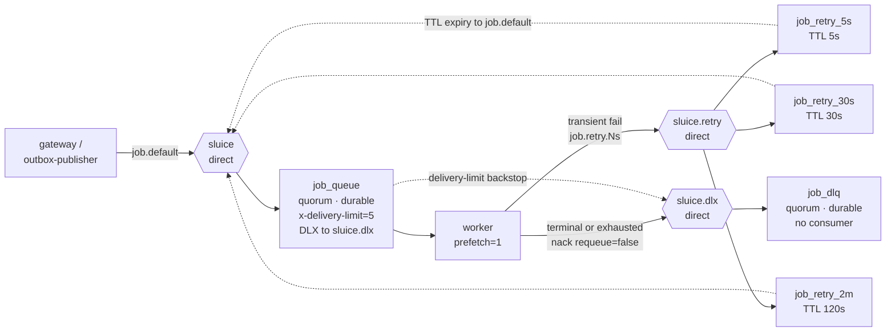
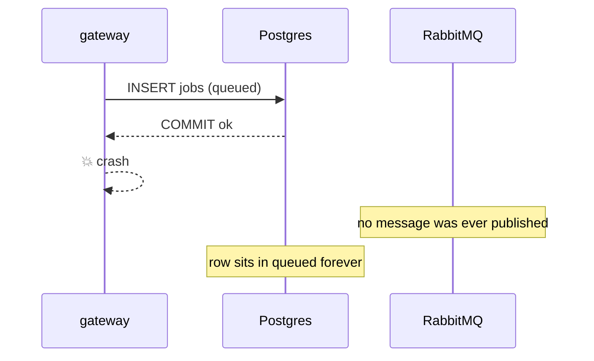
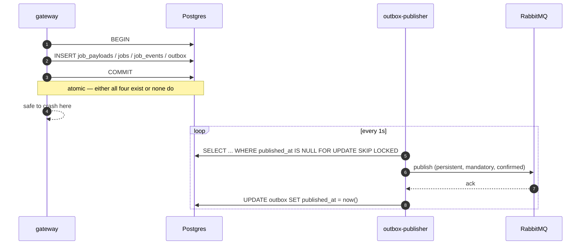

# Messaging Topology

Index: [[00_index]] · Prev: [[04_data_model]] · Next: [[06_worker_and_serving]]

---

## Topology



### Declarations

```go
// Exchanges — all durable, non-auto-delete.
ch.ExchangeDeclare("sluice",       "direct", true, false, false, false, nil)
ch.ExchangeDeclare("sluice.retry", "direct", true, false, false, false, nil)
ch.ExchangeDeclare("sluice.dlx",   "direct", true, false, false, false, nil)

// Main work queue.
ch.QueueDeclare("job_queue", true, false, false, false, amqp.Table{
    "x-queue-type":              "quorum",
    "x-dead-letter-exchange":    "sluice.dlx",
    "x-dead-letter-routing-key": "job.dead",
    "x-delivery-limit":          int32(5),
})
ch.QueueBind("job_queue", "job.default", "sluice", false, nil)

// One queue per delay tier — see the head-of-line note below.
for _, t := range []struct{ name string; ttl int32 }{
    {"job_retry_5s", 5_000}, {"job_retry_30s", 30_000}, {"job_retry_2m", 120_000},
} {
    ch.QueueDeclare(t.name, true, false, false, false, amqp.Table{
        "x-queue-type":              "quorum",
        "x-message-ttl":             t.ttl,
        "x-dead-letter-exchange":    "sluice",       // back to the main exchange
        "x-dead-letter-routing-key": "job.default",
    })
    ch.QueueBind(t.name, "job.retry."+strings.TrimPrefix(t.name, "job_retry_"),
        "sluice.retry", false, nil)
}

// Parking lot.
ch.QueueDeclare("job_dlq", true, false, false, false, amqp.Table{
    "x-queue-type": "quorum",
})
ch.QueueBind("job_dlq", "job.dead", "sluice.dlx", false, nil)
```

Topology is declared idempotently at startup by every process that touches it. Declaring is cheap and makes a fresh broker self-provisioning; there is no separate setup step to forget.

---

## Quorum queues

Classic queue mirroring was **removed in RabbitMQ 4.0**, so quorum queues are the durable-replicated option — not a preference, the only forward path. Two consequences worth knowing:

**`x-delivery-limit` is free poison-message protection.** After that many deliveries the broker dead-letters the message itself. This is defence in depth on the retry loop: the application counts attempts in `jobs.attempt` and stops at `max_attempts = 3`, and the broker independently stops at 5. If the application-level counting ever breaks — a bug in the attempt increment, a reaper loop — the broker still halts it instead of spinning forever. Set it explicitly; RabbitMQ 4 defaults to 20, which is a very long time to burn a worker slot.

**Quorum queues do not support priorities in any useful form.** That happens to cost nothing here: `README.MD` already chooses *bulkheads over priorities*, so separate queues per workload class ([[10_roadmap]] Phase 9) is the intended mechanism anyway.

---

## Delayed retry

`nack(requeue=true)` redelivers **immediately**. A downstream outage therefore burns all three attempts in about a second, and the job dies while the dependency is still merely restarting. That is the gap listed under *Not yet implemented* in `README.MD`.

Two ways to fix it:

| Approach | Needs | Verdict |
|---|---|---|
| `rabbitmq_delayed_message_exchange` plugin | custom image built on `rabbitmq:4-management`, plugin enabled | arbitrary per-message delay, but plugin state is not replicated and it does not compose with quorum queues cleanly |
| **TTL + DLX loop** | nothing — stock image | fixed delay tiers only; **chosen** |

The loop: the worker publishes the failed message to `sluice.retry` with routing key `job.retry.5s`. It lands in `job_retry_5s`, which has no consumer. Five seconds later its TTL expires, and because that queue's DLX points back at `sluice`, the broker moves it into `job_queue` on its own. Backoff with zero moving parts.

> **The head-of-line trap.** TTL expiry is evaluated only at the **head** of a queue. Put a 30 s message and then a 5 s message in the *same* queue and the 5 s one waits behind the 30 s one — the delay you get is the maximum of everything ahead of it, not your own. This is why there is one queue per delay tier rather than a per-message TTL. Getting this wrong produces a backoff that appears to work under light load and mysteriously stretches under bursts.

Tier selection by attempt: attempt 1 → `5s`, attempt 2 → `30s`, attempt 3 → `2m`. Exhausted → dead-letter.

---

## Dead-lettering

`README.MD` has the worker "mark dead, publish to DLQ, ack". Use `x-dead-letter-exchange` plus `nack(requeue=false)` instead.

```python
await message.nack(requeue=False)   # broker routes to sluice.dlx -> job_dlq
```

Less code, one fewer publish that can fail, and the broker stamps an `x-death` header carrying the reason, the original exchange and routing key, the count, and timestamps. That header is exactly what you need when reading the DLQ later, and hand-rolled publishing does not produce it.

The status write to `dead` still happens in Postgres first, in its own transaction, before the nack — **durable before acknowledged** applies to failure paths just as much as success paths.

### The DLQ is a parking lot, not a queue

Nothing consumes `job_dlq`, by design: it exists so failed work is *retained* rather than lost. That means it needs an operator path, or it silently grows into a graveyard nobody reads.

```
sluice dlq list                    # job_id, attempts, x-death reason, age
sluice dlq inspect <job_id>        # full payload + job_events history
sluice dlq replay <job_id>         # reset attempt=0, status=queued, republish
sluice dlq purge --older-than 30d
```

`replay` is the reason `job_events` is append-only: after a replay you need to see both the original failure and the retry in one history. Scheduled for Phase 8 in [[10_roadmap]] — until then, `job_dlq` depth is an alert, not a dashboard ([[08_observability#Alerts]]).

---

## Message contract

Deliberately thin. The payload never travels on the queue — that is the claim check ([[04_data_model#job_payloads]]).

**Body:**

```json
{
  "v": 1,
  "job_id": "0f8a1c2e-...",
  "attempt": 1
}
```

**AMQP properties and headers:**

| Field | Value | Why |
|---|---|---|
| `delivery_mode` | `2` (persistent) | otherwise a broker restart drops it, defeating the entire design |
| `content_type` | `application/json` | |
| `message_id` | the `job_id` | makes broker-side inspection legible |
| `headers.traceparent` | W3C trace context | see below |
| `headers.tracestate` | W3C vendor state | forwarded verbatim |

`v` is a schema version. It costs 9 bytes and it is the difference between a rolling deploy and an outage the first time the message shape changes.

### Why traceparent is a header, not a body field

`README.MD` puts `traceparent` in the JSON body. Move it to headers, for three reasons.

OpenTelemetry propagators operate on a `TextMapCarrier` — a flat string map. AMQP headers *are* that map, so injection and extraction are one line each and work with any propagator. Second, a header can be read **before** the body is parsed, so a message that fails to deserialise still produces a span on the right trace instead of an orphan. Third, tracing stops being coupled to message schema: bumping `v` cannot break trace continuity.

```go
// publish side
headers := amqp.Table{}
otel.GetTextMapPropagator().Inject(ctx, amqpHeaderCarrier(headers))
```

```python
# consume side
ctx = extract(AmqpHeaderGetter(message.headers))
with tracer.start_as_current_span("job.execute", context=ctx, kind=CONSUMER):
    ...
```

Without this the distributed trace dies at the queue boundary and you lose the ability to follow one request end to end — which, for a system whose whole purpose is to decouple submit from execute, is most of the observability value. See [[08_observability#Traces]].

---

## Publisher confirms

A bare `Publish` returns as soon as the bytes reach the socket. It does **not** mean the broker accepted or persisted anything. Without confirms, "published" is a hope.

```go
ch.Confirm(false)   // once, per channel

dc, err := ch.PublishWithDeferredConfirmWithContext(ctx, "sluice", "job.default",
    true,  // mandatory — surface unroutable instead of discarding
    false,
    amqp.Publishing{
        DeliveryMode: amqp.Persistent,
        ContentType:  "application/json",
        MessageId:    jobID.String(),
        Headers:      headers,
        Body:         body,
    })
if err != nil {
    return err
}
ok, err := dc.WaitContext(ctx)
if err != nil || !ok {
    return fmt.Errorf("broker did not confirm publish: %w", err)   // leave outbox row unpublished
}
```

`mandatory: true` matters as much as the confirm. Without it, a message with no matching binding — a routing-key typo, a queue that failed to declare — is **silently discarded** by the broker, and the publish still reports success. With it, the message comes back on `NotifyReturn`:

```go
returns := ch.NotifyReturn(make(chan amqp.Return, 8))
go func() {
    for r := range returns {
        logger.Error("unroutable message", "reply", r.ReplyText,
            "exchange", r.Exchange, "routing_key", r.RoutingKey)
        metrics.UnroutableTotal.Inc()   // alert on this — it means broken topology
    }
}()
```

---

## Consumer settings

```python
await channel.set_qos(prefetch_count=1)
```

Prefetch is the single most consequential consumer setting here. With `prefetch_count=N`, a worker buffers N messages locally; anything queued behind a 40-second job on that worker waits for it, **even while other workers sit idle**. That is head-of-line blocking, and it is exactly what drill 2 exists to expose.

`prefetch=1` is correct precisely because service times span 2000× ([[README|README.MD]]). If jobs were uniform and short, a higher prefetch would win on throughput by amortising round trips — the trade-off is real, it just does not apply to this workload.

### consumer_timeout

RabbitMQ closes a channel whose delivery has been unacked for longer than `consumer_timeout` (default 30 min). A legitimately long job therefore looks exactly like a crashed worker, and the failure is confusing because it presents as a channel error rather than a timeout.

```conf
# deploy/rabbitmq.conf — must be mounted; there is no env var for this
consumer_timeout = 900000   # 15 min in ms
```

The invariant, validated at boot ([[02_tech_stack#Config]]): `CONSUMER_TIMEOUT` > p99 job duration, and `CONSUMER_TIMEOUT` > `JOB_DEADLINE_DEFAULT`. Its interaction with `LEASE_TTL` is subtler and is covered in [[07_reliability_and_drills#The two clocks problem]].

---

## Transactional outbox

### The gap, in Phase 1

The gateway commits the job row, then publishes. A crash in between leaves a `queued` row with no message. Nothing consumes it; nothing reports it.



Idempotency does not help — that covers the *duplicate* case, not the lost one. The only thing that eventually notices is the reaper's deadline sweep, which marks it `expired` after `JOB_DEADLINE_DEFAULT`. So the client gets an answer, but the work never ran and the answer is wrong-ish. Loud enough to debug, too slow and too lossy to accept.

### The fix

Write the intent to publish in the **same transaction** as the job row, then let a separate loop drain it.



```sql
-- name: ClaimOutboxBatch :many
SELECT id, job_id, exchange, routing_key, payload, headers
  FROM outbox
 WHERE published_at IS NULL
 ORDER BY id
   FOR UPDATE SKIP LOCKED
 LIMIT $1;
```

`SKIP LOCKED` again, so the publisher is safe at n>1 with no leader election, exactly as the reaper is.

A crash after the broker's ack but before the `UPDATE` republishes the message — the outbox is **at-least-once**, not exactly-once. That is fine and deliberate: the duplicate meets the claim guard in [[04_data_model#Claim: queued to running]] and becomes a counted duplicate skip. Trying to make the publisher exactly-once would mean a distributed transaction between Postgres and RabbitMQ, which is the thing this whole pattern exists to avoid.

Published rows are marked, not deleted, then purged on the reaper's slow tick:

```sql
DELETE FROM outbox WHERE published_at < now() - interval '1 hour';
```

An hour of history is enough to answer "was this actually published?" during an incident, and keeps the partial index on `published_at IS NULL` near-empty.

### Interim mitigation

Until Phase 7 lands, a republish sweep in the reaper closes most of the hole:

```sql
SELECT id FROM jobs
 WHERE status = 'queued'
   AND created_at < now() - interval '30 seconds'
   FOR UPDATE SKIP LOCKED LIMIT 100;
```

Republish each. Duplicates are safe, so the only cost is noise — and it makes the failure recoverable instead of terminal. It is a poor imitation of the outbox, and it is worth having on day one rather than waiting for Phase 7.

---

Next: [[06_worker_and_serving]]
