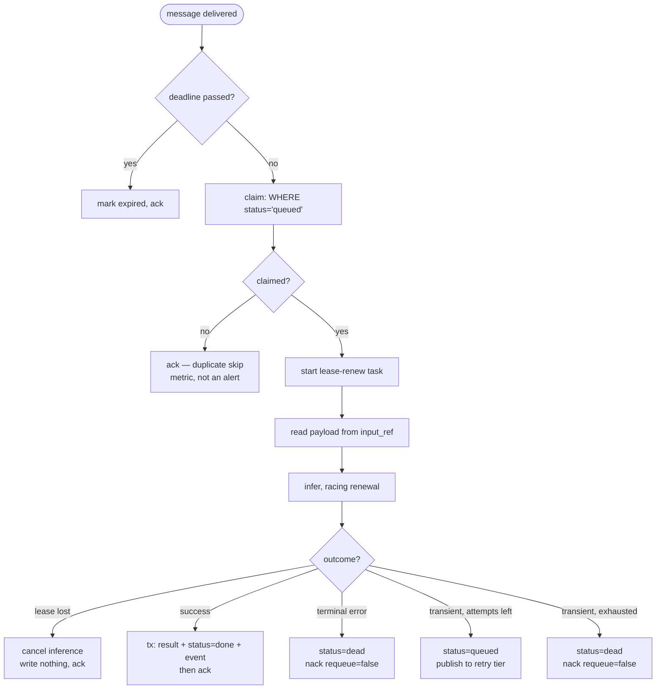

# Worker & Model Serving

Index: [[00_index]] · Prev: [[05_messaging_topology]] · Next: [[07_reliability_and_drills]]

The worker is a thin adapter around a model call, wrapped in a claim, a lease, and an ack. Sluice is **not a model server** ([[README|README.MD]] non-goals) — no batching, no GPU scheduling, no KV cache. Put vLLM or Triton behind it.

---

## Worker loop



Two paths differ from the README's flow, both explained below: **lease lost** ([[#Losing the lease mid-flight]]) and the split between terminal and transient errors ([[#Error taxonomy]]).

---

## Concurrency model

One asyncio event loop, `prefetch_count=1`, one job in flight per process. Concurrency comes from running more worker containers, not more tasks per worker — which keeps the unit of failure equal to the unit of work and makes drill 1 meaningful.

Three things run concurrently during a job:

```python
async def handle(message: AbstractIncomingMessage) -> None:
    job = await claim(...)
    if job is None:
        await message.ack()               # duplicate skip
        metrics.duplicate_skips.inc()
        return

    lost = asyncio.Event()
    renew = asyncio.create_task(renew_loop(job.id, WORKER_ID, lost))
    try:
        result = await run_with_lease(job, lost)
    finally:
        renew.cancel()
```

`WORKER_ID` must be unique per process **and per restart**:

```python
WORKER_ID = f"{socket.gethostname()}:{os.getpid()}:{uuid4().hex[:8]}"
```

The random suffix is not decoration. Container runtimes reuse hostnames, and PIDs recycle; an ambiguous `lease_owner` makes "which worker died" unanswerable at exactly the moment you need it, and in the worst case lets a restarted process renew a lease it no longer logically holds.

---

## Model adapters

```python
# worker/sluice_worker/models/base.py
from typing import Protocol
from dataclasses import dataclass
from datetime import datetime


@dataclass(frozen=True)
class InferResult:
    body: bytes
    content_type: str = "application/json"


class ModelAdapter(Protocol):
    model_id: str

    async def infer(self, payload: bytes, *, deadline: datetime) -> InferResult: ...
```

That is the entire extension point. The registry is a dict, and `model_id` validation in the gateway reads from the same list ([[03_api_contract#Validation]]) so an unknown model fails at submit with `422` instead of dead-lettering three attempts later.

```python
REGISTRY: dict[str, ModelAdapter] = {
    a.model_id: a
    for a in (EchoAdapter(), BoomAdapter(), UnstableAdapter(), SlowAdapter())
}
```

### Stub adapters

The default model is a stub, and that is a design choice rather than a placeholder: the distributed-systems problems here are entirely independent of the model, so a stub lets you reproduce any failure on demand and run 50 workers on a laptop.

Each stub exists to make one drill reproducible ([[07_reliability_and_drills]]):

```python
class EchoAdapter:
    """Baseline. Matches the README's stub: 0.5-8 s, 5% transient failure."""
    model_id = "echo"

    async def infer(self, payload: bytes, *, deadline: datetime) -> InferResult:
        await asyncio.sleep(random.uniform(0.5, 8.0))
        if random.random() < 0.05:
            raise TransientError("simulated transient failure")
        return InferResult(body=payload)


class BoomAdapter:
    """Drill 3a: always fails TERMINALLY. Must dead-letter on attempt 1."""
    model_id = "boom"

    async def infer(self, payload: bytes, *, deadline: datetime) -> InferResult:
        raise TerminalError("this model always fails, by design")


class UnstableAdapter:
    """Drill 3b: always fails TRANSIENTLY. Must exhaust max_attempts with
    backoff and then dead-letter — never loop forever."""
    model_id = "unstable"

    async def infer(self, payload: bytes, *, deadline: datetime) -> InferResult:
        raise TransientError("this model always fails transiently, by design")


class SlowAdapter:
    """Drill 2: one long job must not block the other workers."""
    model_id = "slow"

    async def infer(self, payload: bytes, *, deadline: datetime) -> InferResult:
        await asyncio.sleep(60.0)
        return InferResult(body=payload)
```

### Real adapters, later

```python
class VLLMAdapter:
    model_id = "vllm"

    def __init__(self, base_url: str, client: httpx.AsyncClient):
        self._base_url, self._client = base_url, client

    async def infer(self, payload: bytes, *, deadline: datetime) -> InferResult:
        budget = (deadline - datetime.now(UTC)).total_seconds()
        try:
            r = await self._client.post(
                f"{self._base_url}/v1/completions",
                content=payload,
                timeout=budget,               # never outlive the job deadline
            )
        except (httpx.ConnectError, httpx.ReadTimeout) as e:
            raise TransientError(str(e)) from e

        if r.status_code == 422:
            raise TerminalError(f"model rejected input: {r.text[:200]}")
        if r.status_code >= 500:
            raise TransientError(f"upstream {r.status_code}")
        r.raise_for_status()
        return InferResult(body=r.content, content_type="application/json")
```

Note the two mappings an adapter is responsible for: **every network call gets a timeout derived from the job deadline**, and **upstream status codes are classified** into transient or terminal. Those are the only two things an adapter has to get right.

---

## Error taxonomy

```python
class TransientError(Exception):
    """Retryable. Network blip, upstream 5xx, timeout, transient OOM."""

class TerminalError(Exception):
    """Not retryable. Malformed input, schema violation, model rejection.
    A second attempt is guaranteed to fail identically."""
```

`README.MD`'s worker flow retries every failure up to `max_attempts`. Distinguishing the two is a real improvement, and the reason is concrete: a malformed payload will fail identically on all three attempts. Retrying it consumes two extra worker slots and — with the delay tiers from [[05_messaging_topology#Delayed retry]] — keeps the job alive for 5 s + 30 s of backoff, delaying genuine work behind it, before reaching the same conclusion available on attempt 1.

| Failure | Class | Attempts used |
|---|---|---|
| upstream connection refused | transient | up to 3, with backoff |
| upstream 503 | transient | up to 3 |
| inference timeout | transient | up to 3 |
| payload fails schema validation | terminal | 1 |
| model rejects input (`422`) | terminal | 1 |
| `model_id` missing from registry | terminal | 1 |
| unhandled exception in adapter | **transient** | up to 3 |

The last row is the safe default: an exception you have not classified might be transient, and wrongly retrying costs two worker slots, while wrongly dead-lettering loses the job. Default to the cheaper mistake, then classify it properly once you have seen it.

---

## Deadline propagation

Every job has a deadline; every network call has a timeout derived from it.

```python
async def run_with_lease(job: Job, lost: asyncio.Event) -> InferResult:
    remaining = (job.deadline_at - datetime.now(UTC)).total_seconds()
    if remaining <= 0:
        raise DeadlineExceeded()

    budget = min(remaining, MAX_ATTEMPT_SECONDS)
    async with asyncio.timeout(budget):
        return await race_against_lease_loss(job, lost)
```

The deadline is checked twice — once before the claim, once before the inference — because a job can sit in a retry tier for two minutes between those points. Checking before the claim avoids even incrementing `attempt` on work that can no longer be delivered on time.

> **Honest caveat on blocking adapters.** A real CPU- or GPU-bound adapter must run off the event loop via `await asyncio.to_thread(sync_infer, payload)`. But `to_thread` **cannot be cancelled** — when the `asyncio.timeout` fires, the coroutine raises while the thread keeps running to completion, holding a GPU and a connection. For a genuinely blocking backend, the right shape is a subprocess you can signal, or a backend that honours a server-side timeout of its own (which is why `VLLMAdapter` passes `timeout=budget` to the HTTP call rather than relying on the outer timeout). Worth knowing before the stub is swapped for something real.

---

## Losing the lease mid-flight

This is the failure the README's flow does not cover, and it follows directly from having a reaper.

The worker claims a job and starts a 40-second inference. It stalls — GC pause, swap, a hung socket — long enough to miss a lease renewal. The reaper sees the stale lease, flips the row back to `queued`, and another worker claims and completes it. Then the first worker wakes up and tries to write *its* result.

The version guard on `CompleteJob` ([[04_data_model#Complete: running to done]]) already rejects that write, so correctness is safe either way. But waiting for the guard means burning the rest of a 40-second inference on work that is already provably useless. Detect the loss and abandon immediately:

```python
async def renew_loop(job_id: UUID, owner: str, lost: asyncio.Event) -> None:
    while True:
        await asyncio.sleep(LEASE_RENEW_INTERVAL)
        if not await db.renew_lease(job_id, owner, LEASE_TTL):
            # Zero rows: reaper reclaimed it, or someone else finished it.
            lost.set()
            return


async def race_against_lease_loss(job: Job, lost: asyncio.Event) -> InferResult:
    adapter = REGISTRY[job.model_id]
    infer = asyncio.create_task(adapter.infer(job.payload, deadline=job.deadline_at))
    watch = asyncio.create_task(lost.wait())

    done, _ = await asyncio.wait({infer, watch}, return_when=asyncio.FIRST_COMPLETED)

    if watch in done:
        infer.cancel()
        raise LeaseLost()      # ack, write nothing, count it
    watch.cancel()
    return infer.result()
```

`LeaseLost` acks the message and writes nothing. The job is already someone else's responsibility, and a second delivery is not needed. Count it as `sluice_leases_lost_total` — a nonzero rate means workers are stalling, which is a capacity or GC problem, not a job problem.

---

## Graceful shutdown

`SIGTERM` must not drop in-flight work. Drill 5 exists to prove it.

```python
async def shutdown(queue: AbstractQueue, tag: str, inflight: asyncio.Event) -> None:
    await queue.cancel(tag)          # stop NEW deliveries; keeps the connection open
    try:
        await asyncio.wait_for(inflight.wait(), timeout=SHUTDOWN_GRACE)
    except TimeoutError:
        log.error("shutdown grace exceeded; in-flight job will be redelivered")
        # Do NOT ack. Exiting without an ack is the correct, recoverable outcome.
    await connection.close()
```

`basic_cancel` before draining is the whole trick: it stops the flow of new messages without closing the connection, so the job already running can still ack when it finishes.

Three grace periods must be ordered consistently, and getting this wrong makes drill 5 fail in a way that looks like a code bug:

```
p99 job duration  <  SHUTDOWN_GRACE  <  docker stop_grace_period
                                     <  k8s terminationGracePeriodSeconds
```

If the platform kills the container before `SHUTDOWN_GRACE` elapses, the in-process drain is decorative. With `SHUTDOWN_GRACE = 90s`:

```yaml
# docker-compose.yaml
worker:
  stop_grace_period: 120s
```

Exiting without an ack is safe by design — the delivery was never acknowledged, so the broker redelivers and the claim guard turns it into either a fresh execution or a duplicate skip. **Never ack to make shutdown quiet.** That is the one action here that converts a recoverable interruption into silent loss.

---

## Idempotent execution, restated

Nothing above relies on the broker delivering exactly once, because no broker can. The guarantee comes from three properties composed:

1. The broker delivers **at least once** — its job, and it does it.
2. The claim is a **conditional update**, so exactly one delivery wins.
3. The result write is **durable before the ack**, so a crash produces a redelivery rather than a hole.

Exactly-once *execution* is built in the database. Exactly-once *delivery* is never assumed.

---

Next: [[07_reliability_and_drills]]
