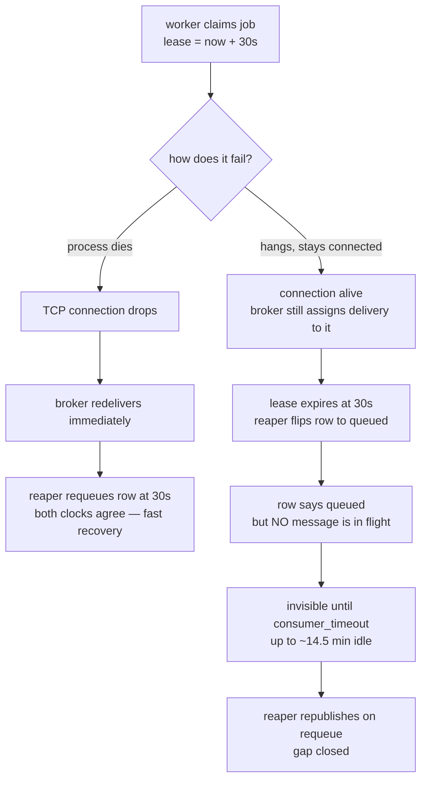

# Reliability & Drills

Index: [[00_index]] · Prev: [[06_worker_and_serving]] · Next: [[08_observability]]

Five drills. Code that passes fewer than five is not finished.

**Run each one without the fix first.** A pattern you have watched break is one you remember; a pattern you reasoned about is one you will re-derive incorrectly in six months.

---

## Shared harness

```bash
export TOKEN=dev_token
export API=localhost:8080

submit() {  # submit <model_id> <key>
  curl -sX POST "$API/v1/jobs" \
    -H "authorization: Bearer $TOKEN" \
    -H 'content-type: application/json' \
    -H "idempotency-key: $2" \
    -d "{\"model_id\":\"$1\",\"input\":\"hello\"}"
}

history() {  # history <job_id> — the single most useful query in the system
  docker compose exec -T postgres psql -U postgres -d sluice -c \
    "SELECT from_status, to_status, actor, attempt, created_at
       FROM job_events WHERE job_id = '$1' ORDER BY id;"
}

census() {
  docker compose exec -T postgres psql -U postgres -d sluice -c \
    "SELECT status, count(*) FROM jobs GROUP BY status ORDER BY status;"
}

stuck() {  # any running job whose lease has gone stale = a reaper failure
  docker compose exec -T postgres psql -U postgres -d sluice -c \
    "SELECT id, attempt, lease_owner, lease_expires_at FROM jobs
      WHERE status = 'running' AND lease_expires_at < now();"
}
```

Keep the RabbitMQ management UI open at `localhost:15672` throughout. Watching **queue depth** and **unacked** move is most of the value — the numbers tell the story before the logs do.

---

## Drill 1 — kill a worker mid-job

> `docker kill -s KILL` a worker mid-job → redelivered, executes exactly once, result correct.

```bash
docker compose up -d --scale worker=1
submit slow drill1_001          # 60 s job
history <job_id>                # wait for queued -> running
docker compose kill -s KILL worker
```

**Without the reaper.** `queued → running`, then nothing. Ever. RabbitMQ redelivers correctly (the delivery was never acked), the claim hits `WHERE status = 'queued'`, matches zero rows, and the worker acks it as a duplicate. The row is stranded in `running` permanently, with no error and no alert. `stuck` shows it; nothing else does. This is the failure that justifies the whole lease mechanism.

**With the reaper.** Four events, in order:

```
queued  -> running   worker:a1b2   attempt=1
running -> queued    reaper:c3d4   attempt=1     <- lease went stale
queued  -> running   worker:e5f6   attempt=2
running -> done      worker:e5f6   attempt=2
```

Pass criteria: exactly one `-> done` event, `job_payloads` holds one `result` row, and the result is correct. `attempt = 2` is expected and correct — at-least-once delivery, exactly-once *execution*.

---

## Drill 2 — head-of-line blocking

> 5 workers, one 60 s job → the other four keep draining.

```bash
docker compose up -d --scale worker=5
submit slow drill2_slow
for i in $(seq 1 20); do submit echo "drill2_fast_$i"; done
```

**Without `prefetch=1`** (set `PREFETCH_COUNT=20` to reproduce): one worker buffers up to 20 messages locally. Everything it buffered behind the 60 s job waits the full 60 s **while four workers sit idle**. Watch the per-consumer unacked count in the management UI — one consumer holding 20, the others holding 0, is the picture of the bug.

**With `prefetch=1`.** The 20 fast jobs finish in seconds across four workers; the slow job finishes at ~60 s on the fifth. Unacked never exceeds 1 per consumer.

---

## Drill 3 — poison job dead-letters

> A job that always raises → dead-letters after 3 attempts, no infinite loop.

Two variants, because the error taxonomy in [[06_worker_and_serving#Error taxonomy]] splits them.

```bash
submit boom     drill3a_001    # TerminalError  -> dead on attempt 1
submit unstable drill3b_001    # TransientError -> dead after 3, with backoff
```

**3a expected:** two events, `queued → running`, `running → dead`, `attempt = 1`. No retry, because a second attempt is provably pointless.

**3b expected:** `attempt` reaches 3, with the message visiting `job_retry_5s` then `job_retry_30s` between attempts. Total elapsed ≈ 35 s of backoff. Then `running → dead`, and `job_dlq` depth becomes 1 with an `x-death` header naming the reason.

**The failure to watch for:** infinite looping. Remove the `CASE` from `ReleaseStaleLeases` ([[04_data_model#Reaper — release stale leases]]) and a job that kills its worker requeues forever, consuming a worker slot on every pass. `attempt` is incremented on *claim* precisely so this terminates.

Also confirm the broker's independent backstop: with `x-delivery-limit = 5`, even a broken application-level attempt counter cannot loop forever ([[05_messaging_topology#Quorum queues]]).

---

## Drill 4 — load shedding

> 5000 jobs, 1 worker → gateway sheds with 429 + Retry-After, backlog stays bounded.

```bash
docker compose up -d --scale worker=1
seq 1 5000 | xargs -P 32 -I{} sh -c \
  'curl -s -o /dev/null -w "%{http_code}\n" -X POST localhost:8080/v1/jobs \
     -H "authorization: Bearer $TOKEN" -H "content-type: application/json" \
     -H "idempotency-key: drill4_{}" -d "{\"model_id\":\"echo\",\"input\":\"x\"}"' \
  | sort | uniq -c
```

**Without shedding:** every request returns `202`, queue depth climbs to 5000, and p99 queue-wait becomes unbounded. Push it far enough and RabbitMQ enters memory flow control and *blocks publishers* — at which point the gateway's `POST` latency spikes and the system fails in the worst way, as a slow success rather than a fast rejection.

**With shedding:** roughly `1000 × 202` then a wall of `429`, and queue depth plateaus near `SHED_QUEUE_DEPTH`. Every `429` carries `Retry-After`.

The point of the drill is the shape of the failure, not the count. **A fast, honest rejection is a better outcome than a slow, dishonest acceptance** — you cannot buy GPU capacity in 200 ms, so the only options are to say no early or to lie.

> Depth is read via `QueueDeclarePassive`, which returns the message count over AMQP without an HTTP round trip, cached behind a 1-second ticker. Do not query it per request — 5000 concurrent submits would then generate 5000 broker round trips, and the admission controller becomes the bottleneck it exists to prevent.

---

## Drill 5 — scale down mid-job

> Scale down mid-job → in-flight work drains, nothing dropped.

```bash
docker compose up -d --scale worker=5
for i in $(seq 1 10); do submit slow "drill5_$i"; done
sleep 5
docker compose up -d --scale worker=1     # SIGTERM to four workers
```

**Without graceful shutdown:** `SIGTERM` kills the process mid-inference. Recoverable — the ack never happened — but the work is redone from scratch, so four jobs lose up to 60 s each.

**With graceful shutdown:** `basic_cancel` stops new deliveries, the in-flight job finishes and acks, then the process exits. Verify:

```bash
census    # 10 done, 0 running, 0 dead
stuck     # empty
```

**The trap that makes this drill fail for the wrong reason:** if `stop_grace_period` is below `SHUTDOWN_GRACE`, Docker `SIGKILL`s the container before the drain finishes and the in-process logic never gets to run. Check the ordering in [[06_worker_and_serving#Graceful shutdown]] before concluding the code is wrong.

---

## The two clocks problem

Two independent clocks decide when interrupted work comes back, and they do not know about each other.

| Clock | Owner | Value | Says |
|---|---|---|---|
| `LEASE_TTL` | Postgres | 30 s | "the row may be reclaimed" |
| `CONSUMER_TIMEOUT` | RabbitMQ | 15 min | "the delivery may be reassigned" |



**Case A — the worker process dies.** The TCP connection drops, so the broker immediately requeues the unacked delivery. The reaper independently clears the row at 30 s. Both clocks agree within seconds, and recovery is fast.

**Case B — the worker hangs but stays connected.** A GC death spiral, a deadlock, or a socket read with no timeout. The connection is healthy, so the broker keeps the delivery assigned to that consumer. Meanwhile the lease expires, and the reaper flips the row to `queued`. Now the database says the job is ready to run and the queue contains nothing. **The job is idle and invisible for up to `CONSUMER_TIMEOUT − LEASE_TTL` ≈ 14.5 minutes.**

Nothing is broken, and nothing reports a problem. That is what makes this class of bug expensive.

### The fix

**The reaper republishes whenever it requeues a row.** This is refinement 7 in [[00_index#Refinements to the README]].

It is safe for free, because duplicates were already solved: if the broker later redelivers the original too, the second delivery meets the claim guard and becomes a counted duplicate skip ([[04_data_model#Claim: queued to running]]). The cost is one extra message; the benefit is closing a 14-minute blind spot.

This is the same lesson as the reaper itself, applied once more: **the component that reconciles two systems must also repair both of them**, not just the one it can see.

---

## Clock skew — why every timestamp comes from `now()`

Every timestamp in [[04_data_model#Guarded transitions]] is computed as `now() + $n::interval` inside Postgres, never as a Go or Python `time.Now()` passed in as a parameter. This is deliberate.

The reaper's entire correctness rests on comparing `lease_expires_at < now()`. If `lease_expires_at` were written using a *worker's* clock and read using the *database's* clock, then any skew between them breaks the comparison in one of two directions:

- Worker clock **ahead** → leases appear to expire later than they should, so a dead worker's job stays stuck past its TTL.
- Worker clock **behind** → leases appear already expired, so the reaper steals jobs from workers that are alive and working. Under skew of more than `LEASE_TTL`, *every* job gets reclaimed mid-flight and the system livelocks.

Using one clock — the database's — makes skew unrepresentable rather than merely unlikely. The rule: **any timestamp that will later be compared against another timestamp must be generated by the same clock that will do the comparing.**

---

## Failure mode inventory

| Failure | Detected by | Outcome | Residual gap |
|---|---|---|---|
| worker `SIGKILL` mid-job | broker conn drop + reaper | redelivered, exactly-once | none |
| worker hangs, stays connected | reaper (lease) | requeued **and republished** | duplicate skip later — counted |
| worker `SIGTERM` (scale down) | in-process drain | finishes and acks | redelivered if grace exceeded |
| gateway crash after commit, before publish | outbox publisher | published next tick | Phase 7; before that, expires after `deadline_at` |
| broker down at submit | outbox | jobs accepted, drain on recovery | `202` promised, queue latency unbounded |
| broker down mid-job | ack failure on reconnect | job redelivered | result already written → duplicate skip |
| Postgres down at submit | `/readyz` | `503`, replica pulled from LB | client sees `503` — correct |
| Postgres down mid-job | claim/renew failure | lease lapses, reaper requeues | none |
| poison payload (classified) | terminal error | `dead` on attempt 1 | needs correct classification |
| poison payload that kills the process | reaper `CASE` on attempt | `dead` after `max_attempts` | costs 3 worker deaths |
| duplicate delivery | claim guard | ack + skip | none — expected path |
| result written, ack lost | claim guard on redelivery | duplicate skip | none |
| stale worker writes result late | version guard on `CompleteJob` | write rejected, result discarded | none |
| unroutable message | `mandatory` + `NotifyReturn` | logged, alerted | job waits for the republish sweep |
| clock skew | — | **unrepresentable by design** | all timestamps from `now()` |
| DLQ grows unread | depth alert | operator intervention | needs the CLI — Phase 8 |

---

## Known gaps

Carried from `README.MD`, plus what these notes surfaced. Tracked in [[10_roadmap]].

| Gap | Consequence | Phase |
|---|---|---|
| No transactional outbox | crash between commit and publish loses the job until deadline | 7 |
| No DLQ operator tooling | dead jobs are retained but unreadable and unreplayable | 8 |
| No long polling | clients poll on `Retry-After`; `LISTEN/NOTIFY` would fix it | 9 |
| No per-class queues | one workload class can still starve another for worker slots | 9 |
| No token streaming | needs a pub/sub relay; the SSE connection lives on one replica | 9 |
| `to_thread` is uncancellable | a blocking adapter outlives its own timeout | 9 |
| Auth is a shared static token | no quotas, rotation, revocation, or tenant isolation | out of scope |
| `job_payloads` has no purge job | unbounded retention — **PDPA relevant**, see [[04_data_model#Data retention and PDPA]] | 5 |

---

Next: [[08_observability]]
