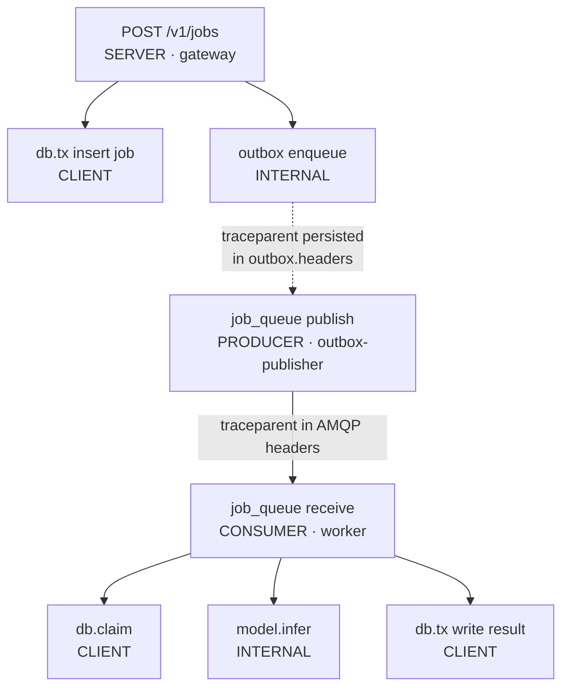

# Observability

Index: [[00_index]] · Prev: [[07_reliability_and_drills]] · Next: [[09_project_layout]]

An async system hides its failures by design — a client that got a `202` cannot tell you the work never ran. Instrumentation is not a finishing touch here; it is the only way anyone finds out.

---

## Metrics

### Gateway

| Metric | Type | Labels |
|---|---|---|
| `sluice_http_requests_total` | counter | `route`, `method`, `status` |
| `sluice_http_request_duration_seconds` | histogram | `route`, `method` |
| `sluice_jobs_submitted_total` | counter | `model_id` |
| `sluice_jobs_shed_total` | counter | — |
| `sluice_idempotent_replays_total` | counter | — |
| `sluice_idempotency_conflicts_total` | counter | — |

### Worker

| Metric | Type | Labels |
|---|---|---|
| `sluice_jobs_claimed_total` | counter | `model_id` |
| `sluice_duplicate_skips_total` | counter | — |
| `sluice_jobs_completed_total` | counter | `model_id`, `outcome` (`done`/`dead`/`expired`) |
| `sluice_job_queue_wait_seconds` | histogram | `model_id` |
| `sluice_job_duration_seconds` | histogram | `model_id` |
| `sluice_inference_duration_seconds` | histogram | `model_id` |
| `sluice_job_attempts` | histogram | `model_id` |
| `sluice_leases_lost_total` | counter | — |
| `sluice_orphaned_results_total` | counter | — |
| `sluice_worker_inflight` | gauge | — |

### Reaper

| Metric | Type | Labels |
|---|---|---|
| `sluice_leases_reclaimed_total` | counter | `next_status` (`queued`/`dead`) |
| `sluice_jobs_expired_total` | counter | — |
| `sluice_republished_total` | counter | — |
| `sluice_reaper_sweep_duration_seconds` | histogram | `sweep` |

### Outbox and broker

| Metric | Type | Labels |
|---|---|---|
| `sluice_outbox_pending` | gauge | — |
| `sluice_outbox_lag_seconds` | gauge | — |
| `sluice_outbox_published_total` | counter | — |
| `sluice_unroutable_total` | counter | — |
| `sluice_queue_depth` | gauge | `queue` |
| `sluice_queue_unacked` | gauge | `queue` |

---

## The two metrics that matter most

**`sluice_job_queue_wait_seconds`** — `created_at` to claim. This is the latency the *user* experiences, and it is the one number a service-time histogram cannot show you. A model that runs in 200 ms behind a 40-minute backlog is a 40-minute system. Keeping service time and queue wait as separate histograms is the whole point: they fail for different reasons and have different fixes (better model vs more capacity).

**`sluice_leases_reclaimed_total`** — the canary for everything in [[07_reliability_and_drills]]. In a healthy system it is flat at zero. Any sustained nonzero rate means workers are dying or stalling, and it will show up here *before* it shows up as user-visible latency. Split by `next_status`: reclaims to `queued` are recoverable, reclaims to `dead` mean a job has exhausted its attempts by killing workers, which is a much worse signal.

---

## Histogram buckets

Prometheus defaults top out at 10 s, which is useless when service times span 20 ms to 40 s — everything interesting lands in `+Inf`.

```go
var jobDurationBuckets = []float64{
    0.01, 0.025, 0.05, 0.1, 0.25, 0.5, 1, 2.5, 5, 10, 20, 40, 80, 160,
}
```

Roughly logarithmic, covering the full 2000× spread with the top bucket above `JOB_DEADLINE_DEFAULT` so a job at its deadline is still measurable rather than clipped.

---

## Cardinality

Two rules, both easy to violate by accident.

**Never label with an unbounded value.** No `job_id`, no `idempotency_key`, no client-supplied string. Each distinct label value is a separate time series, and one such label turns a handful of series into millions.

**Label with the route *pattern*, not the path.** This one bites specifically because it looks correct:

```go
// WRONG — /v1/jobs/<uuid> creates one series per job, forever.
route := r.URL.Path

// RIGHT — yields the literal "/v1/jobs/{id}".
route := chi.RouteContext(r.Context()).RoutePattern()
```

`model_id` is safe to label because it is bounded by the adapter registry ([[06_worker_and_serving#Model adapters]]) — and the gateway rejects unknown values with `422`, so a client cannot inject new label values by guessing.

---

## Traces

`traceparent` rides in AMQP headers ([[05_messaging_topology#Why traceparent is a header, not a body field]]) so one trace spans submit and execute despite them being minutes and processes apart.



The subtlety worth noticing: the publish happens in a **different process at a different time** from the request that created the job. So the trace context has to be persisted in `outbox.headers` at insert time and re-injected by the publisher. Skip that and every trace breaks at the outbox boundary — which is exactly where you most want to see whether a job was ever published.

Span attributes worth setting: `sluice.job_id`, `sluice.model_id`, `sluice.attempt`, `sluice.worker_id`. High-cardinality values are fine on **spans** (they are sampled, not aggregated); they are only fatal on metric labels.

---

## Logs

`log/slog` in Go, `structlog`-style JSON in Python. Every line carries the same three keys:

```go
logger := slog.With(
    "job_id",     jobID,
    "trace_id",   trace.SpanContextFromContext(ctx).TraceID().String(),
    "request_id", middleware.GetReqID(ctx),
)
```

Log **state transitions and decisions**, not progress. `job_events` is already the authoritative history ([[04_data_model#Events go in the same transaction]]), so a log line that merely restates a transition is noise. Log the things the table cannot hold: why a payload was classified terminal, which dependency failed a readiness check, what the broker said when it refused a publish.

### Correlation

One chain, end to end:

```
client sees   request_id = 01J8ZQ4T7K2M9XVB   (in the problem+json body)
    -> grep logs for request_id                -> finds trace_id + job_id
    -> trace_id in the trace UI                -> full span tree, submit to execute
    -> job_id in job_events                    -> authoritative state history
```

The `request_id` in every RFC 9457 error body ([[03_api_contract#Errors — RFC 9457]]) exists to make that first hop possible from a user's screenshot.

---

## Alerts

Five worth paging or ticketing on. Everything else is a dashboard.

| Alert | Condition | Why | Severity |
|---|---|---|---|
| **Outbox stalled** | `sluice_outbox_lag_seconds > 60` | jobs accepted with `202` and never queued — the closest thing to silent data loss | page |
| **Workers dying** | `rate(sluice_leases_reclaimed_total[5m]) > 0` for 10 m | crash loop or systemic stalling | page |
| **Unroutable messages** | `rate(sluice_unroutable_total[5m]) > 0` | broken topology; messages would be silently discarded without `mandatory` | page |
| **Backlog diverging** | `sluice_queue_depth` increasing for 15 m | arrival rate exceeds service rate; capacity decision needed | ticket |
| **Dead letters present** | `sluice_queue_depth{queue="job_dlq"} > 0` | work is retained but needs a human | ticket |

### Track, do not alert

Three metrics look like errors and are not. Alerting on them trains people to ignore alerts.

- **`sluice_duplicate_skips_total`** — the expected outcome of a redelivery whose work already completed. It is at-least-once delivery working correctly, called out explicitly in `README.MD`. A *step change* is worth investigating; a nonzero baseline is health.
- **`sluice_orphaned_results_total`** — the version guard rejecting a stale write. This is the safety mechanism doing its job. It should correlate with `leases_reclaimed_total`; alert on the cause, not the symptom.
- **`sluice_jobs_shed_total`** — admission control working. A `429` is the system telling the truth about its capacity. Alert on backlog divergence instead, which is shedding *failing*.

---

## Dashboard

Six panels, in the order you would actually read them during an incident.

1. **Submit rate and outcome** — `jobs_submitted_total` vs `jobs_shed_total` vs `2xx/4xx/5xx`. Is traffic arriving, and are we accepting it?
2. **Queue depth and unacked**, per queue including `job_dlq` and the retry tiers. Is work accumulating, and where?
3. **Queue wait p50/p95/p99** — the user-facing latency.
4. **Service time p50/p95/p99** and `inference_duration` — is the model slow, or is the queue long?
5. **Reliability counters** — `leases_reclaimed`, `leases_lost`, `duplicate_skips`, `orphaned_results`. Is the recovery machinery active, and how hard is it working?
6. **Outbox lag and pending** — is anything accepted but unqueued?

Panels 3 and 4 side by side are the diagnostic that pays for the whole dashboard: **high wait with low service time is a capacity problem; high service time is a model problem.** Those have entirely different fixes, and without both numbers the two are indistinguishable from the outside.

---

Next: [[09_project_layout]]
