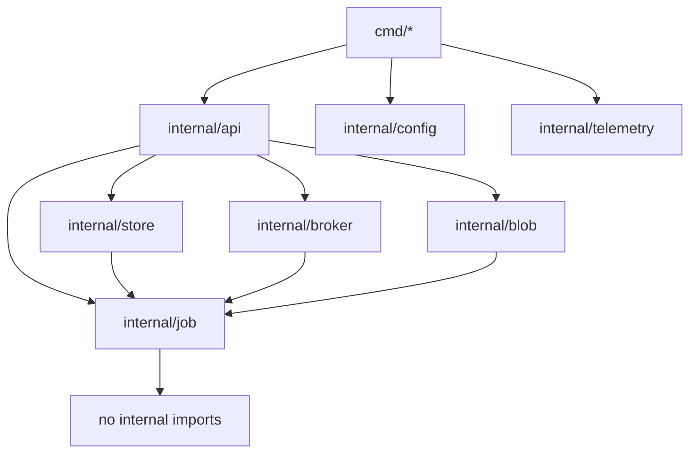

# Project Layout

Index: [[00_index]] · Prev: [[08_observability]] · Next: [[10_roadmap]]

---

## Tree

```
sluice/
├── cmd/
│   ├── gateway/main.go            # HTTP API
│   ├── reaper/main.go             # lease + deadline sweeps, republish
│   ├── publisher/main.go          # outbox drain (Phase 7)
│   └── sluicectl/main.go          # DLQ CLI (Phase 8)
├── internal/
│   ├── config/                    # env -> typed struct, validated at boot
│   ├── job/                       # domain types: Status, Job, transition rules
│   ├── api/                       # chi router, handlers, middleware, DTOs
│   │   ├── router.go
│   │   ├── jobs.go
│   │   ├── health.go
│   │   ├── middleware.go          # Auth, ShedOnQueueDepth, MaxBody, AccessLog
│   │   └── problem/               # RFC 9457 responses
│   ├── store/
│   │   ├── queries/               # hand-written .sql — the guards live here
│   │   │   ├── jobs.sql
│   │   │   ├── events.sql
│   │   │   ├── payloads.sql
│   │   │   └── outbox.sql
│   │   └── gen/                   # sqlc output — generated, committed
│   ├── broker/                    # topology, publisher w/ confirms, depth cache
│   ├── blob/                      # BlobStore iface + postgres impl (+ s3 later)
│   └── telemetry/                 # slog, otel, prometheus registries
├── migrations/                    # goose .sql, //go:embed'd
├── worker/                        # Python
│   ├── pyproject.toml
│   ├── uv.lock
│   └── sluice_worker/
│       ├── __main__.py
│       ├── config.py              # pydantic-settings
│       ├── consumer.py            # aio-pika, prefetch, shutdown
│       ├── claim.py               # asyncpg guarded statements
│       ├── lease.py               # renew loop, LeaseLost
│       ├── errors.py              # TransientError / TerminalError
│       ├── telemetry.py
│       └── models/
│           ├── base.py            # ModelAdapter protocol, InferResult
│           ├── stubs.py           # echo, boom, unstable, slow
│           └── vllm.py
├── deploy/
│   ├── docker-compose.yaml
│   └── rabbitmq.conf
├── docs/                          # this vault
├── sqlc.yaml
├── Makefile
└── go.mod
```

Both `cmd/reaper` and `cmd/publisher` are separate binaries because they have genuinely separate failure domains and tick rates. If running four containers locally is tedious, compile them as subcommands of one `sluice-workers` binary — that is a packaging decision, not an architectural one.

---

## Dependency rules



Two rules, enforced by review and by `go list`:

1. **`internal/job` imports nothing internal.** It holds `Status`, the legal transition set, and the domain types. Everything can depend on it; it depends on nothing. This is what keeps the transition rules testable without a database.
2. **`store`, `broker`, and `blob` never import `api`.** Dependencies point inward toward the domain. The day an import goes the other way, HTTP concerns have leaked into the persistence layer and the store is no longer reusable by the reaper.

---

## sqlc

```yaml
# sqlc.yaml
version: "2"
sql:
  - engine: postgresql
    schema: migrations          # sqlc reads goose annotations directly
    queries: internal/store/queries
    gen:
      go:
        package: gen
        out: internal/store/gen
        sql_package: pgx/v5
        emit_interface: true            # Querier iface, for test fakes
        emit_pointers_for_null_types: true
        emit_empty_slices: true
        overrides:
          - db_type: uuid
            go_type: github.com/google/uuid.UUID
          - db_type: timestamptz
            go_type: time.Time
```

Generated code is **committed**. It makes `go build` work without a codegen step for anyone cloning the repo, and it puts schema changes in the diff where they can be reviewed — a changed `ClaimJobParams` in a pull request is exactly the signal you want.

`emit_pointers_for_null_types` gives `*string` for nullable columns rather than `pgtype.Text`, which keeps the domain code readable. `emit_interface` generates a `Querier` interface — useful for the handful of unit tests that genuinely do not need a database.

`schema: migrations` points sqlc at the goose files, so there is **one** definition of the schema. A separate `schema.sql` alongside migrations is a second source of truth that will silently drift.

---

## Migrations

```sql
-- migrations/00001_init.sql
-- +goose Up
CREATE TABLE jobs ( ... );

-- +goose Down
DROP TABLE jobs;
```

```go
//go:embed migrations/*.sql
var migrationsFS embed.FS

func Migrate(ctx context.Context, pool *pgxpool.Pool) error {
    goose.SetBaseFS(migrationsFS)
    if err := goose.SetDialect("postgres"); err != nil {
        return err
    }
    db := stdlib.OpenDBFromPool(pool)
    defer db.Close()
    return goose.UpContext(ctx, db, "migrations")
}
```

Embedded, so migrations ship inside the binary and cannot drift from the code that expects them. Run from a dedicated `make migrate` target rather than automatically at gateway startup: with n replicas, automatic migration means n concurrent attempts to alter the same table on every deploy.

---

## Testing

Three layers, and the middle one carries the weight.

| Layer | Tool | Covers |
|---|---|---|
| Unit | `testing`, `httptest` | config validation, error classification, ref parsing, transition rules |
| Integration | `testcontainers-go` | every guarded statement, against real Postgres and RabbitMQ |
| Drills | `docker compose` | the five scenarios in [[07_reliability_and_drills]] |

**The store layer cannot be mocked, and this is the important point.** Every correctness claim in [[04_data_model#Guarded transitions]] is a claim about PostgreSQL semantics: row-level locking serialising two concurrent claims, `FOR UPDATE SKIP LOCKED` letting n reapers run without coordination, MVCC snapshot visibility in the idempotency race, unique-violation behaviour under concurrency. A mock returns whatever you told it to return, so a green test suite against mocks proves precisely nothing about any of it.

```go
//go:build integration

func TestClaimJob_ConcurrentClaimsExactlyOneWins(t *testing.T) {
    pool := testPool(t)                    // testcontainers Postgres, migrated
    job := insertQueuedJob(t, pool)

    const racers = 16
    var wins atomic.Int32
    var wg sync.WaitGroup
    for i := range racers {
        wg.Add(1)
        go func() {
            defer wg.Done()
            _, err := gen.New(pool).ClaimJob(ctx, gen.ClaimJobParams{
                ID: job.ID, LeaseOwner: fmt.Sprintf("w%d", i), Lease: 30 * time.Second,
            })
            if err == nil {
                wins.Add(1)
            }
        }()
    }
    wg.Wait()

    // The entire exactly-once guarantee, in one assertion.
    if got := wins.Load(); got != 1 {
        t.Fatalf("expected exactly 1 winner, got %d", got)
    }
}
```

That test is the single most valuable one in the repo, and it is meaningless without a real database.

---

## Makefile

```makefile
# Tabs, not spaces.
.PHONY: up down logs migrate sqlc build test test-int lint fmt drill1 drill2 drill3 drill4 drill5

COMPOSE := docker compose -f deploy/docker-compose.yaml

up:            ## start infrastructure and services
	$(COMPOSE) up -d --build
	$(MAKE) migrate

down:
	$(COMPOSE) down

nuke:          ## down + delete volumes (destroys all job history)
	$(COMPOSE) down -v

logs:
	$(COMPOSE) logs -f gateway worker reaper

migrate:
	go run ./cmd/gateway -migrate-only

sqlc:
	sqlc generate
	go build ./...          # fail loudly if generated code broke a caller

build:
	go build -o bin/ ./cmd/...

test:                       ## unit only, no containers
	go test ./...
	cd worker && uv run pytest

test-int:                   ## integration, spins real Postgres + RabbitMQ
	go test -tags=integration -count=1 ./...

lint:
	golangci-lint run
	cd worker && uv run ruff check . && uv run mypy .

fmt:
	go fmt ./...
	cd worker && uv run ruff format .

drill1:        ## kill a worker mid-job
	./scripts/drill1_kill_worker.sh
drill2:        ## head-of-line blocking
	./scripts/drill2_head_of_line.sh
drill3:        ## poison job dead-letters
	./scripts/drill3_poison.sh
drill4:        ## load shedding
	./scripts/drill4_shed.sh
drill5:        ## graceful scale-down
	./scripts/drill5_scale_down.sh

drills: drill1 drill2 drill3 drill4 drill5   ## the definition of done
```

`make sqlc` runs `go build` afterwards on purpose. Regenerating after a schema change can silently alter a struct field, and you want that to fail at `make sqlc` rather than three commits later.

---

## Dev loop

```bash
make up                     # infra + services + migrations
make logs                   # follow

# schema change
vim migrations/00002_x.sql
make migrate && make sqlc    # regenerate + verify callers still compile

# behaviour change
vim internal/store/queries/jobs.sql
make sqlc test-int

# before committing
make fmt lint test test-int
```

Keep `localhost:15672` open while working. Queue depth and unacked counts explain most surprises faster than reading logs — and watching them move is, per `README.MD`, most of the value of running this locally at all.

---

## Configuration reference

Defaults from `README.MD`, with the boot-time invariants from [[02_tech_stack#Config]].

| Variable | Default | Notes |
|---|---|---|
| `DATABASE_URL` | — | required; connects as `sluice_app`, not the owner |
| `RABBITMQ_URL` | — | required |
| `HTTP_ADDR` | `:8080` | |
| `API_TOKENS` | — | comma-separated; dev only |
| `MAX_PAYLOAD_BYTES` | `1048576` | 1 MB |
| `PREFETCH_COUNT` | `1` | higher lets one worker hoard while others idle |
| `MAX_ATTEMPTS` | `3` | then dead-letter |
| `LEASE_TTL` | `30s` | |
| `LEASE_RENEW_INTERVAL` | `10s` | must be `< LEASE_TTL / 2` |
| `REAPER_INTERVAL` | `10s` | |
| `JOB_DEADLINE_DEFAULT` | `5m` | |
| `CONSUMER_TIMEOUT` | `15m` | broker-side, set in `rabbitmq.conf`; must exceed p99 job duration |
| `SHED_QUEUE_DEPTH` | `1000` | `429` above this |
| `SHUTDOWN_GRACE` | `90s` | must be below `stop_grace_period` |
| `PAYLOAD_RETENTION` | `168h` | 7 days — see [[04_data_model#Data retention and PDPA]] |
| `OTEL_EXPORTER_OTLP_ENDPOINT` | — | unset disables tracing |

`CONSUMER_TIMEOUT` appears in both the app config and `rabbitmq.conf`. The app copy exists only so the boot-time validator can catch a contradiction with `JOB_DEADLINE_DEFAULT`; the broker copy is the one that takes effect.

---

Next: [[10_roadmap]]
