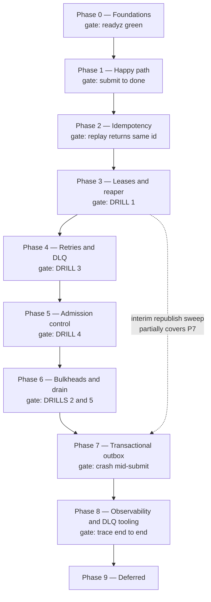

# Roadmap

Index: [[00_index]] · Prev: [[09_project_layout]]

Nine phases. Each has a **gate** — a demonstrable behaviour, not a checklist. Five of the gates are the drills from [[07_reliability_and_drills]], which is the point: the definition of done was written before the code.

---

## Phase graph

---

## Why this order

Three sequencing choices are deliberate and worth stating, because the obvious alternatives are worse.

**Leases (3) before retries (4).** The reaper is the hardest idea in the system, and drill 1 is the failure that motivates every other mechanism. Build it while the flow is still simple enough to watch a single job move through it. Retry logic then reads as an ordinary branch rather than a second concurrency puzzle layered on an unproven one.

**Admission control (5) after retries (4).** Shedding is only meaningful once the queue can genuinely back up. Build it earlier and you are tuning a threshold against a backlog that drains too cleanly to be realistic.

**The outbox (7) late, despite being a real correctness gap.** A crash between commit and publish loses a job ([[05_messaging_topology#The gap, in Phase 1]]), which sounds like a Phase 1 problem. But it is a narrow window, the interim republish sweep in Phase 3 closes most of it, and building the outbox early means every subsequent phase is debugged through an extra asynchronous hop. Ship the mitigation early, the real fix once the flow it protects is stable.

---

## Phase 0 — Foundations

**Goal.** Everything boots, connects, and reports honestly.

- `docker-compose.yaml`: healthchecks + `depends_on: condition: service_healthy`, mounted `rabbitmq.conf` ([[02_tech_stack#Local infrastructure]])
- `internal/config` with boot-time invariant validation
- `migrations/00001_init.sql` — all four tables, constraints, indexes, `sluice_app` role ([[04_data_model#DDL]])
- `sqlc.yaml` generating into `internal/store/gen`
- `internal/telemetry`: slog, Prometheus registry, OTel tracer provider
- `cmd/gateway` serving `/healthz`, `/readyz`, `/metrics` only
- Broker topology declared idempotently at startup ([[05_messaging_topology#Declarations]])

**Gate.** `make up` from a clean volume, `/readyz` returns `200`, and stopping Postgres flips it to `503` naming `postgres` — while `/healthz` stays `200`.

That last part is the real test. If `/healthz` also goes red, the liveness/readiness split is wrong and a future database blip will trigger a restart storm ([[03_api_contract#healthz vs readyz]]).

---

## Phase 1 — Happy path

**Goal.** One job, submit to result, no failure handling.

- `POST /v1/jobs` → payload + job row in one transaction, publish, `202`
- `GET /v1/jobs/{id}`, `GET /v1/jobs/{id}/result`
- `internal/blob` postgres `BlobStore`
- Python worker: consume, claim, `EchoAdapter`, write result, ack
- `job_events` written in the same transaction as every state change

**Gate.** `submit echo demo_1` reaches `done`; `job_events` shows exactly `queued → running → done`; the result bytes match the input.

---

## Phase 2 — Idempotency and concurrency

**Goal.** Duplicates are harmless, and the claim is provably exactly-once.

- `Idempotency-Key` header + `request_hash`; `200` on replay, `409` on key reuse ([[03_api_contract#Idempotency]])
- Claim guard, duplicate-skip path, `sluice_duplicate_skips_total`
- Version guard on `CompleteJob`
- RFC 9457 problem responses throughout
- The concurrent-claim integration test ([[09_project_layout#Testing]])

**Gate.** Same key twice returns the same `job_id` with `200`. Same key with a different body returns `409`. Sixteen concurrent claims on one job produce exactly one winner.

---

## Phase 3 — Leases and the reaper

**Goal.** A dead worker's job comes back. This is the heart of the system.

- `lease_owner` + `lease_expires_at` set on claim
- Renew loop in the worker; **no version bump on renewal** ([[04_data_model#Renew lease]])
- `LeaseLost` detection, cancelling in-flight inference ([[06_worker_and_serving#Losing the lease mid-flight]])
- `cmd/reaper`: lease sweep + deadline sweep, `FOR UPDATE SKIP LOCKED`, `CASE` on exhausted attempts
- **Reaper republishes on requeue** ([[07_reliability_and_drills#The two clocks problem]])
- Interim republish sweep for `queued` rows older than 30 s
- `sluice_leases_reclaimed_total`

**Gate — drill 1.** Run it **without the reaper first** and watch the job strand in `running` forever. Then add the reaper and watch it recover with `attempt = 2` and exactly one `done` event.

---

## Phase 4 — Retries and dead-lettering

**Goal.** Failure terminates, in bounded time, without looping.

- `TransientError` / `TerminalError` and the classification table ([[06_worker_and_serving#Error taxonomy]])
- `attempt` counting, `max_attempts`, `RequeueForRetry`, `KillJob`
- Retry tier queues with TTL + DLX ([[05_messaging_topology#Delayed retry]])
- `job_dlq` via `x-dead-letter-exchange` + `nack(requeue=False)`
- `x-delivery-limit = 5` broker backstop
- `boom` and `unstable` stub adapters

**Gate — drill 3, both variants.** `boom` dies on attempt 1. `unstable` dies after 3 attempts having visited the 5 s and 30 s tiers. Neither loops. `job_dlq` holds both with `x-death` headers.

---

## Phase 5 — Admission control and deadlines

**Goal.** Say no quickly rather than yes dishonestly.

- Cached queue depth via `QueueDeclarePassive`, 1 s ticker
- `ShedOnQueueDepth` middleware on `POST` only — never on reads
- `429` + `Retry-After`
- `deadline_at`, checked before claim and before inference
- Deadline expiry sweep in the reaper
- `job_payloads` retention purge on a slow reaper tick ([[04_data_model#Data retention and PDPA]])

**Gate — drill 4.** 5000 submits against 1 worker yields a mix of `202` and `429`; queue depth plateaus near `SHED_QUEUE_DEPTH` instead of climbing to 5000.

---

## Phase 6 — Bulkheads and drain

**Goal.** One slow job cannot block others, and shutdown loses nothing.

- `prefetch_count=1`, with the reasoning documented
- Graceful shutdown: `basic_cancel`, drain, `SHUTDOWN_GRACE`
- `stop_grace_period` ordered above `SHUTDOWN_GRACE`
- `SlowAdapter`
- Gateway `srv.Shutdown`

**Gate — drills 2 and 5.** With `PREFETCH_COUNT=20`, reproduce head-of-line blocking and watch four workers idle behind one buffered queue. Set it to 1 and watch it disappear. Then scale 5 → 1 mid-job and confirm all 10 jobs reach `done` with nothing stuck in `running`.

---

## Phase 7 — Transactional outbox

**Goal.** Close the accept-then-lose window for good.

- `outbox` insert in the same transaction as the job row
- `cmd/publisher`: `SKIP LOCKED` drain, publisher confirms, `mandatory`, `NotifyReturn`
- `traceparent` persisted in `outbox.headers` and re-injected at publish ([[08_observability#Traces]])
- `sluice_outbox_pending`, `sluice_outbox_lag_seconds`, `sluice_unroutable_total`
- Retire the interim republish sweep from Phase 3

**Gate.** Kill the gateway between `COMMIT` and publish — a `SIGKILL` timed inside the transaction boundary, or a fault injection point — and confirm the job still runs once the publisher's next tick fires. Then stop RabbitMQ entirely, submit 100 jobs, confirm all return `202`, restart the broker, and confirm all 100 drain to `done`.

---

## Phase 8 — Observability and DLQ tooling

**Goal.** Failures are legible without a debugger.

- The full metric set with correct buckets and bounded cardinality ([[08_observability#Metrics]])
- End-to-end trace continuity, submit through execute
- `request_id` → `trace_id` → `job_id` correlation on every log line
- The six-panel dashboard and the five alerts
- `sluicectl dlq list | inspect | replay | purge` ([[05_messaging_topology#The DLQ is a parking lot, not a queue]])

**Gate.** Submit a job, then reconstruct its entire life from a single `request_id`: one trace spanning both processes, and `job_events` agreeing with it. Then `sluicectl dlq replay` a dead job and see both the original failure and the retry in one history.

---

## Phase 9 — Deferred

Not gaps to be embarrassed about — scope deliberately excluded until the core is proven.

| Item | Why it was deferred | Trigger to build it |
|---|---|---|
| `LISTEN/NOTIFY` long poll | polling works and is simpler to reason about | clients complain about `Retry-After` latency |
| S3 blob backend | Postgres `bytea` + TOAST is fine at current sizes | payloads regularly exceed a few MB, or clients need presigned URLs |
| Per-class queues | one queue is honest while there is one workload class | a second class exists and can starve the first |
| Token streaming | needs a pub/sub relay; SSE pins a client to one replica | interactive use appears — but note the `README.MD` non-goal first |
| Cancellable blocking adapters | stubs are cancellable; real ones are not | a real GPU adapter replaces the stub ([[06_worker_and_serving#Deadline propagation]]) |
| Real auth | out of scope while not multi-tenant | anything faces untrusted callers |

---

## First session

Concretely, to start Phase 0 today:

1. Fix `docker-compose.yaml` — healthchecks, `service_healthy`, mounted `rabbitmq.conf`, `stop_grace_period` on the worker.
2. `migrations/00001_init.sql` — the full DDL from [[04_data_model#DDL]], including constraints, partial indexes, and the `sluice_app` grants.
3. `internal/config` — the typed struct plus the three boot-time invariants.
4. `cmd/gateway` — chi router with `/healthz`, `/readyz`, `/metrics` and nothing else.
5. `make up` and prove the gate: kill Postgres, watch `/readyz` go `503` while `/healthz` stays `200`.

That is a genuinely small amount of code, and it ends with a system that already tells the truth about its own health — which is the only foundation the rest of this is worth building on.
